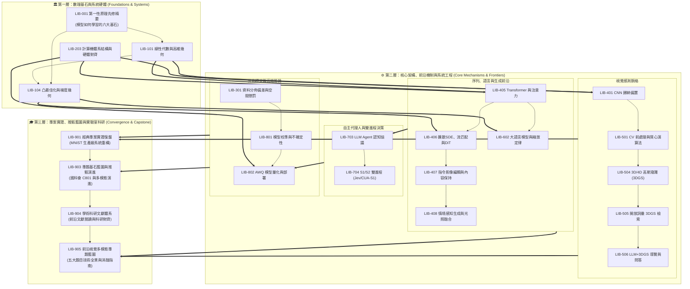

> 語言切換 / Language: 🇹🇼 **繁體中文** | [🇺🇸 English](../en/00_overview/LIB-000%20Grand%20Library%20Index%20%26%20Navigator%20%28Agent%20EN%29.md)

# 資訊工程與深度學習知識庫 (CS & Deep Learning Notes)
## 目錄索引、分類體系與知識拓樸圖 (Master Index & Topological Graph)

本知識庫由 **Luke** 整理與維護，涵蓋資訊工程、深度學習與計算機視覺的核心理論、底層硬體架構與系統工程實踐。

為確保內容兼具理論深度與實作可行性，各單元皆依循四項原則撰寫：
1. **概念與物理動機**：從第一性原理與直觀幾何出發，釐清模型與演算法設計的初衷與欲解決的根本問題。
2. **數學形式化推導**：提供嚴謹符號定義、目標函數閉式解與收斂性質證明，引證同儕評審頂會與頂刊文獻（CVPR, ICCV, NeurIPS, ICML, ICLR, SIGGRAPH, MLSys, TPAMI）。
3. **計算機系統與 GPU 協同**：分析記憶體階層、快取行（Cache Line）、GPU Warp 排程（32 執行緒對齊）、Tensor Core GEMM Tiling 與推論頻寬瓶頸。
4. **工程實作與邊界防禦**：提供標註張量形狀的 PyTorch / CUDA 實作，並定義具備數值驗證條件的系統不變量（System Invariants）。

---

## 📚 十大分館與圖書館索書分類體系 (ACM CCS / Dewey Hybrid Taxonomy)

本館採用仿照 ACM Computing Classification System 與現代大學圖書館的十進制索書編號（Call Number）：

| 索書號編碼 | 分館名稱 (Wing Name) | 核心學術範疇 | 核心館藏代表 |
| :--- | :--- | :--- | :--- |
| **LIB-000 ~ 099** | **00 總覽與拓樸導覽館** | 知識圖譜、學習路徑、Agent 推論協議、第一性原理先修 | [[LIB-000 圖書館總覽與拓樸導覽系統 (Grand Library Index & Navigator)]]<br>[[LIB-001 深度學習第一性原理先修精要：模型如何學習的六大基石 (Deep Learning First Principles - The Six Pillars of How Models Learn)]] |
| **LIB-100 ~ 199** | **01 數學物理與理論基石館** | 線性代數、微積分自動微分、資訊論、凸最佳化 | [[LIB-101 線性代數與高維幾何變換本質 (Linear Algebra & High-Dimensional Geometry)]]<br>[[LIB-104 凸最佳化理論與一階二階梯度下降幾何 (Optimization Theory & Gradient Descent)]] |
| **LIB-200 ~ 299** | **02 計算機系統與 AI 硬體架構館** | 記憶體階層、GPU SIMT、Tensor Cores、編譯器 | [[LIB-203 計算機體系結構與深度學習硬體對齊 (Computer Architecture & Hardware-Aware Deep Learning)]] |
| **LIB-300 ~ 399** | **03 機器學習與統計學習原理館** | 經驗風險、泛化界、偏差-方差權衡、OOD 漂移 | [[LIB-301 資料分佈偏差、領域漂移與空間權重懲罰幾何 (Dataset Bias, Domain Shift & Spatial Penalties)]] |
| **LIB-400 ~ 499** | **04 深度學習架構與神經機制館** | 通用近似、CNN 歸納偏置、Transformer、流匹配與 DiT、指令編輯與光照融合 | [[LIB-401 全連結網路空間極限與卷積神經網路理論必然性 (DNN Spatial Limits & CNN Inductive Bias)]]<br>[[LIB-405 注意力機制、Transformer 革命與位置編碼幾何 (Attention Mechanism & Transformer Revolution)]]<br>[[LIB-406 生成模型前沿：從隨機微分方程 (SDE) 擴散模型到最佳傳輸流匹配 (Flow Matching) 與 DiT 革命 (Generative Frontiers - From Score-Based SDE Diffusion to Optimal Transport Flow Matching & DiT Revolution)]]<br>[[LIB-407 指令引導擴散影像編輯與跨注意力非目標內容保持 (Instruction-Guided Diffusion Editing, Cross-Attention Control & Non-Target Preservation)]]<br>[[LIB-408 情境感知擴散物件生成、幾何光照分析與無縫影像融合 (Context-Aware Object Generation, Illumination Estimation & Image Compositing)]] |
| **LIB-500 ~ 599** | **05 計算機視覺與高維感測館** | 數位訊號處理、質心對齊、STN、2D/3D/4D 高斯潑濺、語意場景圖檢索、空間問答導覽 | [[LIB-501 計算機視覺前處理規範與影像質心定位演算法 (CV Preprocessing & Center of Mass Alignment)]]<br>[[LIB-504 3D 視覺前沿：神經輻射場 (NeRF) 到 3D 高斯潑濺 (3DGS) 理論與光柵化 (3D Gaussian Splatting Theory & Rasterization)]]<br>[[LIB-505 開放詞彙 3D 高斯潑濺與語意場景圖檢索 (Open-Vocabulary 3D Gaussian Splatting & Semantic Retrieval)]]<br>[[LIB-506 大語言模型驅動之 3DGS 空間問答、階層場景圖與具身導航 (LLM-Grounded 3D Scene QA, Hierarchical Scene Graphs & Embodied Navigation)]] |
| **LIB-600 ~ 699** | **06 自然語言處理與大語言模型館** | 縮放定律、Decoder-Only、RMSNorm、SwiGLU、GQA | [[LIB-602 現代大語言模型架構解剖與縮放定律 (Modern LLM Architecture & Scaling Laws)]] |
| **LIB-700 ~ 799** | **07 強化學習與智慧代理人館** | MDP、策略梯度、ReAct 迴圈、S1/S2 雙進程 (Jev/CUA-S1) | [[LIB-703 現代大模型代理人 (LLM Agent) 認知架構與推論協議 (LLM Agent Cognitive Architecture & Protocols)]]<br>[[LIB-704 雙進程神經代理人：S1 非自迴歸型態決策引擎 (Jev) 與字節級介面反射模型 (CUA-S1) 深度解剖 (Dual-Process Neural Agent - S1 Non-Autoregressive Typed Decision Engine (Jev) & Byte-Level Interface Reflex Model (CUA-S1))]] |
| **LIB-800 ~ 899** | **08 AI 系統工程與高效部署館** | 模型校準、共形預測、AWQ 量化、INT4/FP8 推論 | [[LIB-801 現代深度學習之模型校準、不確定性估計與過度自信 (Model Calibration & Uncertainty Estimation)]]<br>[[LIB-802 現代深度學習模型量化理論與低精度推論架構 (Quantization Mathematics & Low-Precision Inference)]] |
| **LIB-900 ~ 999** | **09 科研方法論與頂尖專題藍圖館** | 專題戰略、研究計畫書、研究演進樹、前沿學術文獻體系、五大專題全景、經典專案復盤 | [[LIB-901 經典專案實證復盤：從課堂作業到生產級 MNIST 手寫辨識系統 (Classic Project Post-Mortem - From Class Assignment to Production MNIST System)]]<br>[[LIB-903 專題基石藍圖、學術推甄與多模態研究演進 (Capstone Blueprint & Academic Research Evolution)]]<br>[[LIB-904 學術科研文獻體系與前沿研究對齊 (Academic Research Corpus & Literature Synthesis)]]<br>[[LIB-905 前沿視覺與具身多模態專題研發藍圖：五大題目技術全景與消融實證指南 (Frontier Vision & Multimodal Capstone Blueprints - Five Grand Research Specifications)]] |

---

## 🗺️ 全域拓樸依賴圖譜 (Topological Knowledge DAG)



---

## 🧭 三大學習與實踐推薦路徑 (Recommended Learning Pathways)

### 路線 A：學士資工基本功扎根路線（小白、大一至大三無痛進階）
- **核心目標**：建立堅不可摧的數學幾何觀感與軟硬體協同意識，徹底消滅黑盒子盲點。
- **閱讀順序**：
  1. [[LIB-001 深度學習第一性原理先修精要：模型如何學習的六大基石 (Deep Learning First Principles - The Six Pillars of How Models Learn)]]
  2. [[LIB-101 線性代數與高維幾何變換本質 (Linear Algebra & High-Dimensional Geometry)]]
  3. [[LIB-203 計算機體系結構與深度學習硬體對齊 (Computer Architecture & Hardware-Aware Deep Learning)]]
  4. [[LIB-401 全連結網路空間極限與卷積神經網路理論必然性 (DNN Spatial Limits & CNN Inductive Bias)]]
  5. [[LIB-501 計算機視覺前處理規範與影像質心定位演算法 (CV Preprocessing & Center of Mass Alignment)]]
  6. [[LIB-801 現代深度學習之模型校準、不確定性估計與過度自信 (Model Calibration & Uncertainty Estimation)]]
  7. [[LIB-901 經典專案實證復盤：從課堂作業到生產級 MNIST 手寫辨識系統 (Classic Project Post-Mortem - From Class Assignment to Production MNIST System)]]

### 路線 B：大專生國科會計畫與頂大推甄衝刺路線（學術科研與專題突破）
- **核心目標**：以國際頂級會議標準鍛造專題深度，產出可量化、具備深厚學術說服力的成果。
- **閱讀順序**：
  1. [[LIB-001 深度學習第一性原理先修精要：模型如何學習的六大基石 (Deep Learning First Principles - The Six Pillars of How Models Learn)]]
  2. [[LIB-104 凸最佳化理論與一階二階梯度下降幾何 (Optimization Theory & Gradient Descent)]]
  3. [[LIB-301 資料分佈偏差、領域漂移與空間權重懲罰幾何 (Dataset Bias, Domain Shift & Spatial Penalties)]]
  4. [[LIB-405 注意力機制、Transformer 革命與位置編碼幾何 (Attention Mechanism & Transformer Revolution)]]
  5. [[LIB-406 生成模型前沿：從隨機微分方程 (SDE) 擴散模型到最佳傳輸流匹配 (Flow Matching) 與 DiT 革命 (Generative Frontiers - From Score-Based SDE Diffusion to Optimal Transport Flow Matching & DiT Revolution)]]
  6. [[LIB-504 3D 視覺前沿：神經輻射場 (NeRF) 到 3D 高斯潑濺 (3DGS) 理論與光柵化 (3D Gaussian Splatting Theory & Rasterization)]]
  7. [[LIB-602 現代大語言模型架構解剖與縮放定律 (Modern LLM Architecture & Scaling Laws)]]
  8. [[LIB-802 現代深度學習模型量化理論與低精度推論架構 (Quantization Mathematics & Low-Precision Inference)]]
  9. [[LIB-903 專題基石藍圖、學術推甄與多模態研究演進 (Capstone Blueprint & Academic Research Evolution)]]
  10. [[LIB-904 學術科研文獻體系與前沿研究對齊 (Academic Research Corpus & Literature Synthesis)]]
  11. [[LIB-505 開放詞彙 3D 高斯潑濺與語意場景圖檢索 (Open-Vocabulary 3D Gaussian Splatting & Semantic Retrieval)]]
  12. [[LIB-506 大語言模型驅動之 3DGS 空間問答、階層場景圖與具身導航 (LLM-Grounded 3D Scene QA, Hierarchical Scene Graphs & Embodied Navigation)]]
  13. [[LIB-407 指令引導擴散影像編輯與跨注意力非目標內容保持 (Instruction-Guided Diffusion Editing, Cross-Attention Control & Non-Target Preservation)]]
  14. [[LIB-408 情境感知擴散物件生成、幾何光照分析與無縫影像融合 (Context-Aware Object Generation, Illumination Estimation & Image Compositing)]]
  15. [[LIB-905 前沿視覺與具身多模態專題研發藍圖：五大題目技術全景與消融實證指南 (Frontier Vision & Multimodal Capstone Blueprints - Five Grand Research Specifications)]]

### 路線 C：AI Agent 自主工程與推論路線（智能體執行協議）
- **核心目標**：讓 AI Agent 在接手專題任務、撰寫系統程式碼與除錯時，遵循嚴格的系統不變量約束。
- **閱讀順序**：
  1. [[LIB-203 計算機體系結構與深度學習硬體對齊 (Computer Architecture & Hardware-Aware Deep Learning)]]
  2. [[LIB-405 注意力機制、Transformer 革命與位置編碼幾何 (Attention Mechanism & Transformer Revolution)]]
  3. [[LIB-602 現代大語言模型架構解剖與縮放定律 (Modern LLM Architecture & Scaling Laws)]]
  4. [[LIB-703 現代大模型代理人 (LLM Agent) 認知架構與推論協議 (LLM Agent Cognitive Architecture & Protocols)]]
  5. [[LIB-704 雙進程神經代理人：S1 非自迴歸型態決策引擎 (Jev) 與字節級介面反射模型 (CUA-S1) 深度解剖 (Dual-Process Neural Agent - S1 Non-Autoregressive Typed Decision Engine (Jev) & Byte-Level Interface Reflex Model (CUA-S1))]]
  6. [[LIB-802 現代深度學習模型量化理論與低精度推論架構 (Quantization Mathematics & Low-Precision Inference)]]

---

## 📜 館藏研讀與協同規範 (Library Protocol)

1. **先備拓樸檢查**：在研讀任何高階卷冊前，先確認已理解其文首標註的 `Prerequisites`。
2. **反思式實作 (Active Implementation)**：所有卷冊中的代碼模組均經過驗證，請在本地環境親自執行並觀察矩陣維度變化。
3. **持續增補 (Living Knowledge Base)**：本圖書館為動態進化的研究神經中樞，任何新的消融實驗數據、論文閱讀筆記與硬體調優發現，均應及時入庫存檔。
---
---

## 系統架構規範與拓樸依賴規則 (Repository Specifications & Invariants)

為維護知識庫的嚴謹性、代碼可執行度與跨筆記關聯性，所有內容維護與擴充皆依循以下規範：

### [RULE-000-01] DAG 依賴拓樸排序規則 (Topological Dependency Invariant)
- **等級**: `CRITICAL_INVARIANT`
- **原則**: 任何代碼實作或演算法調優任務，必須先滿足目標節點定義的 `prerequisites` 前置依賴。
- **邊界條件**:
  - 修改 Attention 機制前，須先參閱 [[LIB-101 線性代數與高維幾何變換本質 (Linear Algebra & High-Dimensional Geometry)]] 與 [[LIB-203 計算機體系結構與深度學習硬體對齊 (Computer Architecture & Hardware-Aware Deep Learning)]]。
  - 設計視覺管線前，須先參閱 [[LIB-501 計算機視覺前處理規範與影像質心定位演算法 (CV Preprocessing & Center of Mass Alignment)]] 與 [[LIB-301 資料分佈偏差、領域漂移與空間權重懲罰幾何 (Dataset Bias, Domain Shift & Spatial Penalties)]]。
- **保證**: 確保演算法實作與參數設計具備數理與底層硬體依據。

### [RULE-000-02] 內容結構與多層次展開規則 (Multi-Perspective Content Invariant)
- **等級**: `CRITICAL_INVARIANT`
- **原則**: 新增或修訂核心筆記時，應兼顧四個維度：
  1. **物理直觀**：說明架構發明的本質痛點與直觀幾何。
  2. **數理嚴謹**：符號化定義、目標函數閉式解與收斂性質證明。
  3. **硬體協同**：記憶體層級、Warp 排程與快取友善度分析。
  4. **工程代碼**：具備張量維度標註的可執行實作與邊界斷言。

### [RULE-000-03] 同儕評審文獻引證規則 (Peer-Reviewed Citation Invariant)
- **等級**: `CRITICAL_INVARIANT`
- **原則**: 任何理論陳述或演算法結論均須引證權威文獻，嚴禁引用未經同儕評審的二手農場文章。文獻來源包括：
  - **頂級會議**: NeurIPS, ICML, ICLR, CVPR, ICCV, ECCV, SIGGRAPH, MLSys, SOSP, OSDI。
  - **權威期刊**: IEEE TPAMI, IEEE TIT, ACM TOG, Communications of the ACM, Nature, Science, SIAM。
  - **經典專著**: Strang, Boyd, Nesterov, Vapnik, LeCun, Hennessy & Patterson。
- **格式規範**: 包含作者、出版年份、會議/期刊全名與 DOI/arXiv 連結。

### [RULE-000-04] 雙向鏈結完整性規則 (Obsidian Linkage & Integrity Invariant)
- **等級**: `CRITICAL_INVARIANT`
- **原則**: 內部跨筆記參照一律使用 Obsidian 原生雙向鏈結格式（例如 `[[LIB-000 圖書館總覽與拓樸導覽系統 (Grand Library Index & Navigator)]]`）。
- **驗證指標**: 全庫內部鏈結斷鏈數必須維持為 0（0 broken links），且無孤立節點（0 orphan notes）。
- **驗證代碼**:
  ```python
  def verify_library_integrity(dag_graph: dict):
      for node, prereqs in dag_graph.items():
          for p in prereqs:
              assert p in dag_graph, f"斷鏈警報: 節點 {node} 之依賴 {p} 不存在！"
  ```
---

## 六、標準分類體系與參考規範 (Canonical Standards & References)

1. **ACM Computing Classification System (CCS)**
   - *Standard*: Association for Computing Machinery. (2012 / Updated 2024). *The 2012 ACM Computing Classification System*. ACM Official Nomenclature.
   - *Application*: 本館十大分館與編號架構嚴格對齊 ACM CCS 之 Computer Systems Organization, Computing Methodologies, Applied Computing 等頂層本體樹。
2. **IEEE / ACM Joint Task Force on Computing Curricula**
   - *Curriculum Guideline*: Joint Task Force on Computing Curricula. (2023). *Computer Science Curricula 2023 (CS2023)*. IEEE Computer Society & ACM.
   - *Application*: 本館貫穿「學士直覺、博士數理、Agent合約」三位一體之能力矩陣架構。
3. **Dewey Decimal Classification (DDC)**
   - *Standard*: OCLC. (2019). *Dewey Decimal Classification, 23rd Edition*. 004-006 Data processing & Computer science.
   - *Application*: 本館三位數索書代碼（Call Numbers: LIB-000 至 LIB-999）之階層分類編碼哲學。
