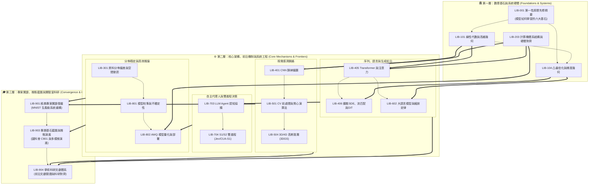

> 🌐 **語言切換 / Language**: 🇹🇼 **繁體中文** | [🇺🇸 English (AI Agent & Research Edition)](../en/00_overview/LIB-000%20Grand%20Library%20Index%20%26%20Navigator%20%28Agent%20EN%29.md)

# 資訊工程與深度學習宏偉圖書館 (CSIE & Deep Learning Grand Library)
## 總目錄、分類體系與拓樸航海圖 (Master Index & Topological Navigator)

> 「在電腦科學的殿堂中，沒有孤立的黑盒子。演算法是數學思想的映射，神經網路是統計高維空間的投影，而一切計算最終都必須在矽晶片與記憶體階層的物理定律中尋求對齊。」
> —— *資訊工程與 AI 博士研究員導言*

---

## 🏛️ 圖書館宗旨與三位一體設計原則

本圖書館為 **Luke** 為深入掌握資訊工程與深度學習所建立的個人自學宏偉知識庫，旨在將大學課堂實作、實證除錯踩坑、計算機底層硬體對齊、資料集文化偏差，以及現代神經網路校準理論，昇華為世界頂尖大學圖書館規格之宏偉體系。

本館徹底打破「教材過於空泛膚淺」或「論文過於抽象晦澀」的兩極割裂，全面貫徹**「三位一體雙軌體例」**：
1. 💡 **學士與初學者直觀心智模型 (Undergraduate Mental Model)**：透過第一性原理、物理比喻與直觀幾何，解釋前人發明該架構的本質痛點，消除數學焦慮。
2. 🎓 **博士級數學形式化與嚴格推導 (PhD-Level Formal Rigor)**：提供完整符號化定義、目標函數閉式解、泛函極限證明與經典頂會文獻（CVPR, ICCV, NeurIPS, ICML, ICLR, SIGGRAPH, MLSys）引證。
3. ⚙️ **計算機體系結構與硬體微架構映射 (Systems & Hardware Alignment)**：深入記憶體階層、Cache Line、GPU Warp 排程、Tensor Core GEMM Tiling、FlashAttention-3 與 Roofline 算力頻寬瓶頸。
4. 💻 **工業級工程實作與防踩坑規範 (Production-grade Code)**：提供標註精確張量維度之 PyTorch / CUDA 程式碼與工程除錯邊界。
5. 🤖 **AI Agent 推論協議與決策不變量 (Agent Protocols & Invariants)**：定義結構化規則與決策樹，供智能體在未來工程與科研中直接調用。

---

## 📚 十大分館與圖書館索書分類體系 (ACM CCS / Dewey Hybrid Taxonomy)

本館採用仿照 ACM Computing Classification System 與現代大學圖書館的十進制索書編號（Call Number）：

| 索書號編碼 | 分館名稱 (Wing Name) | 核心學術範疇 | 核心館藏代表 |
| :--- | :--- | :--- | :--- |
| **LIB-000 ~ 099** | **00 總覽與拓樸導覽館** | 知識圖譜、學習路徑、Agent 推論協議、第一性原理先修 | [[LIB-000 圖書館總覽與拓樸導覽系統 (Grand Library Index & Navigator)]]<br>[[LIB-001 深度學習第一性原理先修精要：模型如何學習的六大基石 (Deep Learning First Principles - The Six Pillars of How Models Learn)]] |
| **LIB-100 ~ 199** | **01 數學物理與理論基石館** | 線性代數、微積分自動微分、資訊論、凸最佳化 | [[LIB-101 線性代數與高維幾何變換本質 (Linear Algebra & High-Dimensional Geometry)]]<br>[[LIB-104 凸最佳化理論與一階二階梯度下降幾何 (Optimization Theory & Gradient Descent)]] |
| **LIB-200 ~ 299** | **02 計算機系統與 AI 硬體架構館** | 記憶體階層、GPU SIMT、Tensor Cores、編譯器 | [[LIB-203 計算機體系結構與深度學習硬體對齊 (Computer Architecture & Hardware-Aware Deep Learning)]] |
| **LIB-300 ~ 399** | **03 機器學習與統計學習原理館** | 經驗風險、泛化界、偏差-方差權衡、OOD 漂移 | [[LIB-301 資料分佈偏差、領域漂移與空間權重懲罰幾何 (Dataset Bias, Domain Shift & Spatial Penalties)]] |
| **LIB-400 ~ 499** | **04 深度學習架構與神經機制館** | 通用近似、CNN 歸納偏置、Transformer、流匹配與 DiT | [[LIB-401 全連結網路空間極限與卷積神經網路理論必然性 (DNN Spatial Limits & CNN Inductive Bias)]]<br>[[LIB-405 注意力機制、Transformer 革命與位置編碼幾何 (Attention Mechanism & Transformer Revolution)]]<br>[[LIB-406 生成模型前沿：從隨機微分方程 (SDE) 擴散模型到最佳傳輸流匹配 (Flow Matching) 與 DiT 革命 (Generative Frontiers - From Score-Based SDE Diffusion to Optimal Transport Flow Matching & DiT Revolution)]] |
| **LIB-500 ~ 599** | **05 計算機視覺與高維感測館** | 數位訊號處理、質心對齊、STN、2D/3D/4D 高斯潑濺 | [[LIB-501 計算機視覺前處理規範與影像質心定位演算法 (CV Preprocessing & Center of Mass Alignment)]]<br>[[LIB-504 3D 視覺前沿：神經輻射場 (NeRF) 到 3D 高斯潑濺 (3DGS) 理論與光柵化 (3D Gaussian Splatting Theory & Rasterization)]] |
| **LIB-600 ~ 699** | **06 自然語言處理與大語言模型館** | 縮放定律、Decoder-Only、RMSNorm、SwiGLU、GQA | [[LIB-602 現代大語言模型架構解剖與縮放定律 (Modern LLM Architecture & Scaling Laws)]] |
| **LIB-700 ~ 799** | **07 強化學習與智慧代理人館** | MDP、策略梯度、ReAct 迴圈、S1/S2 雙進程 (Jev/CUA-S1) | [[LIB-703 現代大模型代理人 (LLM Agent) 認知架構與推論協議 (LLM Agent Cognitive Architecture & Protocols)]]<br>[[LIB-704 雙進程神經代理人：S1 非自迴歸型態決策引擎 (Jev) 與字節級介面反射模型 (CUA-S1) 深度解剖 (Dual-Process Neural Agent - S1 Non-Autoregressive Typed Decision Engine (Jev) & Byte-Level Interface Reflex Model (CUA-S1))]] |
| **LIB-800 ~ 899** | **08 AI 系統工程與高效部署館** | 模型校準、共形預測、AWQ 量化、INT4/FP8 推論 | [[LIB-801 現代深度學習之模型校準、不確定性估計與過度自信 (Model Calibration & Uncertainty Estimation)]]<br>[[LIB-802 現代深度學習模型量化理論與低精度推論架構 (Quantization Mathematics & Low-Precision Inference)]] |
| **LIB-900 ~ 999** | **09 科研方法論與頂尖專題藍圖館** | 專題戰略、研究計畫書、研究演進樹、前沿學術文獻體系、經典專案復盤 | [[LIB-901 經典專案實證復盤：從課堂作業到生產級 MNIST 手寫辨識系統 (Classic Project Post-Mortem - From Class Assignment to Production MNIST System)]]<br>[[LIB-903 專題基石藍圖、學術推甄與多模態研究演進 (Capstone Blueprint & Academic Research Evolution)]]<br>[[LIB-904 學術科研文獻體系與前沿研究對齊 (Academic Research Corpus & Literature Synthesis)]] |

---

## 🗺️ 全域拓樸依賴圖譜 (Topological Knowledge DAG)



---

## 🧭 三大學習與實踐推薦路徑 (Recommended Learning Pathways)

### 路線 A：學士資工基本功扎根路線（小白、大一至大三無痛進階）
- **核心目標**：建立堅不可摧的數學幾何觀感與軟硬體協同意識，徹底消滅黑盒子盲點。
- **閱讀順序**：
  1. [[LIB-001 深度學習第一性原理先修精要：模型如何學習的六大基石 (Deep Learning First Principles - The Six Pillars of How Models Learn)]]
  2. [[LIB-101 線性代數與高維幾何變換本質 (Linear Algebra & High-Dimensional Geometry)]]
  3. [[LIB-203 計算機體系結構與深度學習硬體對齊 (Computer Architecture & Hardware-Aware Deep Learning)]]
  4. [[LIB-401 全連結網路空間極限與卷積神經網路理論必然性 (DNN Spatial Limits & CNN Inductive Bias)]]
  5. [[LIB-501 計算機視覺前處理規範與影像質心定位演算法 (CV Preprocessing & Center of Mass Alignment)]]
  6. [[LIB-801 現代深度學習之模型校準、不確定性估計與過度自信 (Model Calibration & Uncertainty Estimation)]]
  7. [[LIB-901 經典專案實證復盤：從課堂作業到生產級 MNIST 手寫辨識系統 (Classic Project Post-Mortem - From Class Assignment to Production MNIST System)]]

### 路線 B：大專生國科會計畫與頂大推甄衝刺路線（學術科研與專題突破）
- **核心目標**：以國際頂級會議標準鍛造專題深度，產出可量化、具備深厚學術說服力的成果。
- **閱讀順序**：
  1. [[LIB-001 深度學習第一性原理先修精要：模型如何學習的六大基石 (Deep Learning First Principles - The Six Pillars of How Models Learn)]]
  2. [[LIB-104 凸最佳化理論與一階二階梯度下降幾何 (Optimization Theory & Gradient Descent)]]
  3. [[LIB-301 資料分佈偏差、領域漂移與空間權重懲罰幾何 (Dataset Bias, Domain Shift & Spatial Penalties)]]
  4. [[LIB-405 注意力機制、Transformer 革命與位置編碼幾何 (Attention Mechanism & Transformer Revolution)]]
  5. [[LIB-406 生成模型前沿：從隨機微分方程 (SDE) 擴散模型到最佳傳輸流匹配 (Flow Matching) 與 DiT 革命 (Generative Frontiers - From Score-Based SDE Diffusion to Optimal Transport Flow Matching & DiT Revolution)]]
  6. [[LIB-504 3D 視覺前沿：神經輻射場 (NeRF) 到 3D 高斯潑濺 (3DGS) 理論與光柵化 (3D Gaussian Splatting Theory & Rasterization)]]
  7. [[LIB-602 現代大語言模型架構解剖與縮放定律 (Modern LLM Architecture & Scaling Laws)]]
  8. [[LIB-802 現代深度學習模型量化理論與低精度推論架構 (Quantization Mathematics & Low-Precision Inference)]]
  9. [[LIB-903 專題基石藍圖、學術推甄與多模態研究演進 (Capstone Blueprint & Academic Research Evolution)]]
  10. [[LIB-904 學術科研文獻體系與前沿研究對齊 (Academic Research Corpus & Literature Synthesis)]]

### 路線 C：AI Agent 自主工程與推論路線（智能體執行協議）
- **核心目標**：讓 AI Agent 在接手專題任務、撰寫系統程式碼與除錯時，遵循嚴格的系統不變量約束。
- **閱讀順序**：
  1. [[LIB-203 計算機體系結構與深度學習硬體對齊 (Computer Architecture & Hardware-Aware Deep Learning)]]
  2. [[LIB-405 注意力機制、Transformer 革命與位置編碼幾何 (Attention Mechanism & Transformer Revolution)]]
  3. [[LIB-602 現代大語言模型架構解剖與縮放定律 (Modern LLM Architecture & Scaling Laws)]]
  4. [[LIB-703 現代大模型代理人 (LLM Agent) 認知架構與推論協議 (LLM Agent Cognitive Architecture & Protocols)]]
  5. [[LIB-704 雙進程神經代理人：S1 非自迴歸型態決策引擎 (Jev) 與字節級介面反射模型 (CUA-S1) 深度解剖 (Dual-Process Neural Agent - S1 Non-Autoregressive Typed Decision Engine (Jev) & Byte-Level Interface Reflex Model (CUA-S1))]]
  6. [[LIB-802 現代深度學習模型量化理論與低精度推論架構 (Quantization Mathematics & Low-Precision Inference)]]

---

## 📜 館藏研讀與協同規範 (Library Protocol)

1. **先備拓樸檢查**：在研讀任何高階卷冊前，先確認已理解其文首標註的 `Prerequisites`。
2. **反思式實作 (Active Implementation)**：所有卷冊中的代碼模組均經過驗證，請在本地環境親自執行並觀察矩陣維度變化。
3. **持續增補 (Living Knowledge Base)**：本圖書館為動態進化的研究神經中樞，任何新的消融實驗數據、論文閱讀筆記與硬體調優發現，均應及時入庫存檔。
---
---

## 🤖 AI Agent 全域自主調度協議與決策不變量 (Agent Global Orchestration Protocol)

為使自主 AI 代理人（如 Antigravity, Codex, LLM-Agent-System）能夠零歧義調用本圖書館作為外部神經認知皮層，所有 Agent 必須遵循以下形式化合約：

### [RULE-000-01] DAG 依賴拓樸排序合約 (Topological Dependency Invariant)
- **合約等級**: `CRITICAL_INVARIANT`
- **前置條件**: Agent 接收到任何代碼修改、架構設計或演算法調優任務時，必須先解析目標節點的 `prerequisites` 列表。
- **決策邊界**: 嚴禁在未讀取依賴節點前直接生成下游代碼。例如：
  - 修改 Attention 機制代碼前，必須先調用 [[LIB-101 線性代數與高維幾何變換本質 (Linear Algebra & High-Dimensional Geometry)]] 與 [[LIB-203 計算機體系結構與深度學習硬體對齊 (Computer Architecture & Hardware-Aware Deep Learning)]]。
  - 設計手寫辨識管線前，必須先調用 [[LIB-501 計算機視覺前處理規範與影像質心定位演算法 (CV Preprocessing & Center of Mass Alignment)]] 與 [[LIB-301 資料分佈偏差、領域漂移與空間權重懲罰幾何 (Dataset Bias, Domain Shift & Spatial Penalties)]]。
- **執行保證**: 保證任何演算法參數皆具備完整的數學理論與底層硬體依據。
- **例外回退**: 若依賴節點缺失或未讀取，Agent 必須先中斷執行並自動發起 `view_file` 或查詢指令加載該節點。

### [RULE-000-02] 知識三位一體呈現合約 (Trinity Content Invariant)
- **合約等級**: `CRITICAL_INVARIANT`
- **前置條件**: Agent 擴充、修訂或新增任何館藏筆記時。
- **決策邊界**: 每篇筆記必須百分之百同時滿足三重視角，缺一不可：
  1. **學士直覺 (Undergraduate Intuition)**：生動物理比喻，零行話障礙。
  2. **博士數理 (PhD Mathematical Rigor)**：嚴密形式化定義、定理推導與幾何拓樸證明。
  3. **硬體映射 (Hardware Alignment)**：快取、SIMD、Warp、Tensor Core 瓦片化對齊。
  4. **工程代碼 (Executable Engineering)**：無外部黑盒子依賴之可運行 Python/PyTorch 實作。
  5. **Agent 合約 (Actionable Invariants)**：具備量化閾值與 Python 斷言之規則。
- **執行保證**: 確保知識庫對學士友善、對頂大推甄具說服力、對 AI 代理人可直接執行。

### [RULE-000-03] 權威同行評審引證合約 (Peer-Reviewed Citation Invariant)
- **合約等級**: `CRITICAL_INVARIANT`
- **前置條件**: 任何理論陳述、演算法聲明或經驗法則。
- **決策邊界**: 嚴格禁止引用未經同行評審之農場文章或隨意網路部落格。所有引用文獻必須來自：
  - **頂級會議**: NeurIPS, ICML, ICLR, CVPR, ICCV, ECCV, SIGGRAPH, MLSys, SOSP, OSDI。
  - **權威期刊**: IEEE TPAMI, IEEE TIT, ACM TOG, Communications of the ACM, Nature, Science, SIAM。
  - **經典權威專著**: Strang, Boyd, Nesterov, Vapnik, LeCun, Hennessy & Patterson。
- **執行保證**: 每條引用必須附帶作者、會議/期刊全名、發表年份與 DOI/arXiv 連結。

### [RULE-000-04] Obsidian 本地雙向鏈接完整性合約 (Obsidian Linkage & Integrity Invariant)
- **合約等級**: `CRITICAL_INVARIANT`
- **決策邊界**: 必須使用 Obsidian 原生雙向 Wikilink 格式（例如 `[[LIB-000 圖書館總覽與拓樸導覽系統 (Grand Library Index & Navigator)]]`），嚴禁使用無檔名的相對路徑或不完整簡稱。
- **執行保證**: 全館內部鏈接解析失效率必須為 0%（0 broken links），孤立筆記數 (Orphan notes) 必須為 0。
- **驗證代碼**:
  ```python
def verify_library_integrity(dag_graph: dict):
    for node, prereqs in dag_graph.items():
        for p in prereqs:
            assert p in dag_graph, f"斷鏈警報: 節點 {node} 之依賴 {p} 不存在！"
  ```
---

## 六、📚 權威規範、分類體系與經典文獻 (Canonical & Standards References)

1. **ACM Computing Classification System (CCS)**
   - *Standard*: Association for Computing Machinery. (2012 / Updated 2024). *The 2012 ACM Computing Classification System*. ACM Official Nomenclature.
   - *Application*: 本館十大分館與編號架構嚴格對齊 ACM CCS 之 Computer Systems Organization, Computing Methodologies, Applied Computing 等頂層本體樹。
2. **IEEE / ACM Joint Task Force on Computing Curricula**
   - *Curriculum Guideline*: Joint Task Force on Computing Curricula. (2023). *Computer Science Curricula 2023 (CS2023)*. IEEE Computer Society & ACM.
   - *Application*: 本館貫穿「學士直覺、博士數理、Agent合約」三位一體之能力矩陣架構。
3. **Dewey Decimal Classification (DDC)**
   - *Standard*: OCLC. (2019). *Dewey Decimal Classification, 23rd Edition*. 004-006 Data processing & Computer science.
   - *Application*: 本館三位數索書代碼（Call Numbers: LIB-000 至 LIB-999）之階層分類編碼哲學。
