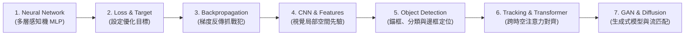

> 🌐 **語言切換 / Language**: 🇹🇼 **繁體中文** | [🇺🇸 English (AI Agent & Research Edition)](../en/00_overview/LIB-001%20Deep%20Learning%20First%20Principles%20%28Agent%20EN%29.md)

# 深度學習第一性原理先修精要：模型如何學習的六大基石 (Deep Learning First Principles - The Six Pillars of How Models Learn)

> 「在急於推導微積分連鎖律與證明損失函數凸性之前，我們必須先回答一個最根本的物理問題：機器究竟是透過什麼機制，將隨機的雜訊旋鈕調整為能夠辨識貓狗、理解語言與生成藝術的神經網路？」
> —— *資訊工程與 AI 博士研究員導言*

---

## 🏛️ 前言：先搞懂模型怎麼學，再去看複雜公式

許多資工系同學在修習「機器學習」或「深度學習」課程時，往往在第一週就被高維空間投影、海森矩陣（Hessian Matrix）與測度論符號勸退。然而，現代人工智慧的本質並非晦澀難解的魔法，而是一套**極度簡潔、優雅且符合物理直覺的動態反饋系統**。

本卷專為**大二、大三資工系學生（如中原資工同學）、專題研究新手與自主 AI 代理人**量身打造。我們遵循**費曼學習法（Feynman Technique）與第一性原理**，暫時屏除繁瑣的符號包袱，從最底層的機械直覺切入，帶你徹底弄懂**模型是怎麼學會看懂世界、承認錯誤並持續進化的**。

---

## 🧭 一、六大核心基石循序深度解剖

```
┌─────────────────┐       ┌─────────────────┐       ┌─────────────────┐
│ 1. 神經網路架構 │ ───>  │  2. 損失函數    │ ───>  │ 3. 反向傳播梯度 │
│ 旋鈕轉動與前向  │       │  嚴格監考官打分 │       │ 倒推連鎖律抓戰犯│
└─────────────────┘       └─────────────────┘       └─────────────────┘
         │                                                   │
         ▼                                                   ▼
┌─────────────────┐       ┌─────────────────┐       ┌─────────────────┐
│ 6. 綜合評估指標 │ <───  │ 5. CNN 特徵抽取 │ <───  │  4. 最佳化器    │
│ Precision/Recall│       │ 邊緣到物體積木  │       │ 腳步大小與慣性輪│
└─────────────────┘       └─────────────────┘       └─────────────────┘
```

---

### 1. 神經網路本體 (Neural Network)
#### (1) 它到底是什麼？
神經網路不是科幻電影中有自我意識的仿生腦細胞，它本質上是**「一台內部裝有成千上萬個音量旋鈕的非線性特徵變換機」**。
你將一組代表現實世界的原始數字（例如圖片的像素灰階值、房子的坪數與屋齡）灌入機器前端，它透過層層旋鈕的加權放大與折疊，最終在出口端吐出另一組數字（例如這張圖屬於貓、狗或車的機率分配）。

#### (2) 資料流向：`input → layer → output`
* **輸入層 (Input Layer, $x$)**：現實資料的向量化表示。設輸入維度為 $d$，$x = [x_1, x_2, \dots, x_d]^T$。
* **隱藏層 (Hidden Layers, $h$)**：網路在內部自我提煉的中間特徵。第一層可能只在乎微小局部，第二層開始關注特徵組合。
* **輸出層 (Output Layer, $\hat{y}$)**：最終任務決策。若是迴歸任務，輸出連續數值；若是分類任務，輸出各類別的機率分佈。

#### (3) 核心旋鈕：Weight（權重）與 Bias（偏置）
* **權重 (Weight, $W$)**：每一條連線上的**「增益倍率（重要性）」**。如果某個特徵對預測結果有決定性影響，網路會將對應的 $W$ 調大；如果是無用雜訊，$W$ 會被調至接近 $0$。
* **偏置 (Bias, $b$)**：神經元的**「預設啟動門檻」**。即便所有輸入特徵皆為 $0$，該神經元本身依然保有的基礎傾向。
* **參數 (Parameters)**：全網路中所有 $W$ 與 $b$ 的集合。常聽到的「70B 大模型」，指的就是機器內部擁有 700 億個旋鈕。
* **非線性激活函數 (Activation Function, 如 ReLU)**：
  如果只有線性矩陣乘法 $z = Wx + b$，即便堆疊一百層，根據矩陣乘法的結合律，它本質上依然等價於單一線性變換。激活函數 $\text{ReLU}(z) = \max(0, z)$ 的作用是**「將高維幾何空間摺疊」**，賦予網路逼近任意複雜非線性決策邊界的能力。

#### (4) 生成模型中的 generator(z) 是什麼？
* **$z$ 是什麼？**：$z$ 是一組從簡單分佈（如高斯分佈 $\mathcal{N}(0, \mathbf{I})$）隨機抽樣的潛在特徵向量（Latent Vector）。你可以把它想像成**「一顆蘊含無限可能性的隨機種子」**。
* **人的工作 vs. 模型的自主學習**：
  * **人類工程師的工作**：設計生成器網路架構（Generator Architecture），例如決定堆疊多少層轉置卷積（ConvTranspose）、加入多少殘差塊與通道維度。
  * **神經網路自己的工作**：**「到底該怎麼把這串看似無意義的隨機雜訊數字 $z$，一步步精確轉換（Mapping）成一張栩栩如生的人臉或風景？」——這個高維幾何對應函數，完全是由模型在訓練過程中，透過反向傳播的梯度自我調整出來的！**

---

### 2. 損失函數 (Loss Function)：模型怎麼知道自己錯了？
#### (1) 嚴格的監考官 (The Referee)
在剛開機時，網路內部的所有旋鈕都是隨機亂數（隨機初始化）。給它一張貓的圖片，它可能盲猜「這是波音 747 飛機」。
**損失函數（Loss Function, $\mathcal{L}$）就是負責給模型打考卷的監考官**。它拿模型的預測值 $\hat{y}$ 與真實標籤（Ground Truth, $y$）進行比對，計算出一個代表「當前預測有多糟糕」的單一純量懲罰分數（Scalar Loss）。
* **核心鐵律**：Loss 越低代表旋鈕配置越好；Loss 越高代表模型胡言亂語。

#### (2) 兩大經典任務的評分規則
1. **迴歸問題（猜測數值大小，如預測房價、物體邊界座標）**：
   * **MSE (Mean Squared Error，均方誤差)**：
     $$\mathcal{L}_{\text{MSE}} = \frac{1}{N} \sum_{i=1}^N (y_i - \hat{y}_i)^2$$
     *直覺*：就像打靶測量彈著點距離靶心差幾公分。差 1 公分罰 1 分，差 10 公分罰 100 分，差越遠懲罰呈平方倍暴增。
2. **分類問題（猜測物體類別，如貓/狗、良品/瑕疵品）**：
   * **Cross-Entropy Loss（交叉熵損失）**：
     $$\mathcal{L}_{\text{CE}} = -\sum_{c=1}^C y_c \log(\hat{y}_c)$$
     *直覺*：**賭盤賠率懲罰**。若真實標籤是「貓」，模型預測「是貓的機率為 99%」，$-\log(0.99) \approx 0.01$（懲罰微乎其微）；但若模型預測「是貓的機率僅 1%」，$-\log(0.01) \approx 4.6$（監考官重重扣分！）。模型越自信地猜錯，懲罰將呈現對數級劇烈爆炸。

---

### 3. 反向傳播與梯度 (Backpropagation / Gradient)
#### (1) 梯度 (Gradient, $\nabla \mathcal{L}$)：多維濃霧中的指路羅盤
* **生活直覺：盲人下山**。
  想像你雙眼被蒙住，置身於濃霧瀰漫的崎嶇山頂（高 Loss 區域）。你的目標是走到地勢最低的山谷底部（最小化 Loss）。
  你雖然看不見山谷在哪裡，但雙腳可以感受腳下每踩一步的**傾斜坡度**：
  * **梯度（Gradient）是一根指向「地勢爬升最快」的向量**。
  * 因此，如果你想要盡快下山，你的本能是轉身朝著**「梯度的反方向（負梯度方向，$-\nabla \mathcal{L}$）」**邁出腳步！

#### (2) 反向傳播 (Backpropagation)：微積分連鎖律倒推抓戰犯
既然監考官算出模型錯了 100 分，我們該如何知道**到底是第 1 層的第 3 個旋鈕該調，還是第 5 層的第 8 個旋鈕該調？**
* **直覺比喻**：一家大企業年底虧損一億元，董事長向下追究財務長責任，財務長追究研發主管責任，研發主管追究基層工程師責任。
* 在數學上，這透過微積分的**連鎖律 (Chain Rule)** 實現：
  $$\frac{\partial \mathcal{L}}{\partial W_l} = \frac{\partial \mathcal{L}}{\partial a_L} \cdot \frac{\partial a_L}{\partial a_{L-1}} \cdots \frac{\partial a_{l+1}}{\partial z_l} \cdot \frac{\partial z_l}{\partial W_l}$$
* **前向傳播 (Forward Pass)**：訊號從左向右流動，計算各層輸出與最終 Loss。
* **反向傳播 (Backward Pass)**：誤差從右向左流動，利用連鎖律把總損失分攤到每一個旋鈕上，計算出偏微分 $\frac{\partial \mathcal{L}}{\partial W}$（即「這個旋鈕若往右轉一微米，整體 Loss 會上升或下降多少」）。

---

### 4. 最佳化器 (Optimizer) 與學習率 (Learning Rate)
知道了每個旋鈕該往哪個方向旋轉，接下來的問題是：**每次旋轉的幅度應該跨多大？**

#### (1) 學習率 (Learning Rate, $\eta$)：邁出的步伐大小
$$\text{新旋鈕設定} = \text{舊旋鈕設定} - \eta \cdot \text{梯度}$$
* **學習率過大 ($\eta = 10.0$)**：盲人一步跨出十里，直接跨過山谷摔上對面峭壁，甚至摔出地圖外，導致 Loss 爆炸變成 `NaN`（數值溢位）。
* **學習率過小 ($\eta = 10^{-7}$)**：盲人每次只挪動一奈米，耗費一百年還走不出山頂平原，陷入訓練停滯。
* **合適的學習率 ($\eta = 10^{-3} \sim 10^{-4}$)**：步伐沉穩、精準下山。

#### (2) 常見最佳化器家族演進
* **SGD (Stochastic Gradient Descent)**：老老實實的一階步伐。缺點是在峽谷地形容易在兩壁來回震盪，前進緩慢。
* **Momentum（動量）**：替盲人裝上**具備物理質量的滾動保齡球**。順著斜坡往下滾時會累積慣性速度，遇到小型坑洞（局部凹陷）能靠動量直接衝過。
* **Adam (Adaptive Moment Estimation)**：**動量慣性 + 獨立自適應油門**。
  * Adam 會替全網路的每一個旋鈕記錄歷史梯度。
  * 頻繁劇烈變動的旋鈕，自動幫它踩煞車防止失控；極少變化的平緩旋鈕，自動加大油門推進。是現代深度學習（LLM、Vision Transformer）工程實作的第一首選。

#### (3) 🌟 工程實踐心態校正：寫程式不用手刻數學，那我們到底在學什麼？
* **現代深度學習框架已經替你封裝了底層數學**：
  在 PyTorch 或 TensorFlow 中，`nn.Linear()` 已經把底層 BLAS 矩陣乘法完全封裝；`loss.backward()` 已經在底層建立了動態計算圖，自動推導微積分連鎖律；`optimizer.step()` 已經替你執行了高維梯度的數值位移。
* **身為現代 AI 工程師與研究員，你的核心職責不是當人肉計算機，而是掌控三大靈魂**：
  1. **模型架構設計 (Model Architecture)**：如何組織網路拓樸（CNN、Transformer、殘差連線、正規化）。
  2. **損失函數制定 (Loss Function)**：如何為任務設計精準的監考官（交叉熵、IoU Loss、對抗損失）。
  3. **訓練與資料流把控 (Training & Data Pipeline)**：學習率排程、Batch Size、正規化與資料增強。

#### (4) 既然不用手刻數學，為什麼數學仍然無比重要？（Debug 的四大多維透視鏡）
**「學數學不是為了每行 Code 都自己手算，而是幫你理解模型為什麼有效，以及在訓練崩潰時提供一雙能看穿黑盒子的眼睛！」**
當你在實務中遇到以下四大災難時，不懂數學的人只能在黑暗中亂猜，懂數學的人一眼就能定位問題所在：
1. **梯度消失 (Gradient Vanishing) 與爆炸 (Exploding)**：
   * *現象*：網路深層的 Loss 突然變成 `NaN`，或者網路前幾層的權重動也不動。
   * *數學透視*：連鎖律是多個雅可比矩陣的連乘。若激活函數導數小於 1（如 Sigmoid），連乘 10 層後梯度趨近於 0；若權重奇異值大於 1，連乘後數值指數量級溢位。解決之道是改用 ReLU、加入殘差連線（ResNet）或使用 LayerNorm。
2. **模式崩潰 (Mode Collapse)**：
   * *現象*：生成模型永遠只生成同一張人臉，喪失所有多樣性。
   * *數學透視*：生成器找到了判別器的一個局部脆弱極小點，生成分佈的支撐集發生維度坍縮，目標分佈的熵值驟降。
3. **Loss 卡在平原動彈不得 (Loss Plateau / Stagnation)**：
   * *現象*：訓練了好幾個 Epoch，Loss 絲毫不降。
   * *數學透視*：高維空間中極少出現純局部極小點，絕大多數都是「鞍點（Saddle Point）」。梯度的模長接近 0，但海森矩陣特徵值正負交錯。SGD 在鞍點寸步難行，必須切換為具備二階估計與自適應油門的 Adam。
4. **特徵條件數惡化 (Ill-conditioned Surface)**：
   * *現象*：學習率稍微設大一點 Loss 就暴衝，設小一點又走不動。
   * *數學透視*：特徵未做標準化，導致損失曲面像一個極端狹長的狹谷（長短軸比例失衡，條件數過大）。梯度方向與山谷底部的真實方向幾乎垂直，造成兩壁瘋狂震盪。解法是強制加入 Batch Normalization 或 LayerNorm。

---

### 5. CNN 與特徵抽取 (Feature Hierarchy)
全連接網路（DNN）若處理高解析度圖片（如 $1920 \times 1080 \times 3$），展開為一維向量會產生數百萬個輸入，破壞像素在二維空間中的鄰近幾何關聯。**卷積神經網路 (CNN) 透過滑動窗口（卷積核 Filter）掃描整張影像，完美模擬了人類視覺皮層的層次化特徵提取**。

#### 影像如何被一層層組裝成認知？（樂高積木原理）
```
[原始像素矩陣] ──> [第一層卷積核: 邊緣幾何] ──> [中間層卷積核: 紋理部件] ──> [深層卷積核: 語意物件]
 1920x1080x3           水平線/垂直線/邊界             圓弧/格子/毛皮斑紋            輪胎/車窗/動物五官
```

1. **淺層特徵 (Low-level: Edges & Gradients)**：
   * 卷積核（通常為 $3 \times 3$ 矩陣）在影像上做滑動點積。
   * 淺層卷積核自發學會類似影像處理的 Sobel 濾鏡：左側權重為負、右側為正，滑過明暗邊界時輸出極大值，精準抓出**水平線、垂直線條與高對比角點**。
2. **中層特徵 (Mid-level: Textures & Motifs)**：
   * 將淺層抽取出的線條加以組合，產生「同心圓」、「棋盤格」、「多邊形」與「毛髮紋理」。
3. **深層特徵 (High-level: Parts & Semantic Objects)**：
   * 隨著多層池化（Pooling）或步長卷積，神經元的**感受野 (Receptive Field)** 逐步擴大至整張影像。
   * 網路開始辨識「車輪」、「車門」、「貓耳」與「眼睛」等具備完整物理意義的語意部件，最後拍板定案分類類別。

---

### 6. 模型評估指標 (Evaluation Metrics)：別被準確率騙了！
模型訓練完成後，我們不能只依賴單一 Loss 數值來驗收成效，必須透過具備嚴格統計意義的評估指標。

#### (1) 分類評估：Accuracy 陷阱與混淆矩陣
* **準確率 (Accuracy) 的欺騙性**：
  在極度不平衡的資料集（例如 1000 個人中只有 1 個罕見重症患者），模型只要投機取巧、盲目預測所有人「完全健康」，其 Accuracy 便高達 **99.9%**！但此模型在醫療實務上完全是致命的廢物。
* **混淆矩陣的兩大靈魂指標（抓小偷比喻）**：
  * **Precision（精確率 / 查準率）**：**「寧缺勿濫」**。
    * 當警報器大響喊「抓到小偷了！」，其中到底有幾成真的是小偷？
    * 公式：$\text{Precision} = \frac{\text{TP}}{\text{TP} + \text{FP}}$。
    * *關鍵場景*：垃圾郵件過濾（絕不能把教授或主管的重要錄取信誤殺至垃圾箱）。
  * **Recall（召回率 / 查全率）**：**「寧可抓錯，不可放過」**。
    * 全場所有混進來的小偷當中，警報系統成功揪出了幾成？漏掉了幾個？
    * 公式：$\text{Recall} = \frac{\text{TP}}{\text{TP} + \text{FN}}$。
    * *關鍵場景*：癌症篩檢、交通違規停車科技執法、動態唇紋生物特徵防偽。

#### (2) 物件偵測評估：框得準不準？
* **IoU (Intersection over Union，交併比)**：
  * 物件偵測模型輸出一個預測框（Bounding Box $B_{\text{pred}}$），人類標註標註出真實框（$B_{\text{gt}}$）。
  * **$\text{IoU} = \frac{\text{Area}(B_{\text{pred}} \cap B_{\text{gt}})}{\text{Area}(B_{\text{pred}} \cup B_{\text{gt}})}$**
  * 重疊比例越高，IoU 越接近 1.0；工業界一般規定 $\text{IoU} \ge 0.5$（或 $0.75$）才算成功擊中目標。
* **mAP (Mean Average Precision，平均精度均值)**：
  * 物件偵測（如 YOLOv8、RT-DETR）與頂級競賽唯一的黃金公認指標。
  * 它在多組不同的分類信心門檻與 IoU 門檻（如 $\text{mAP}_{50}$ 與嚴苛的 $\text{mAP}_{50:95}$）下，積分計算 Precision-Recall 曲線下的面積，代表模型在「位置框得準」與「類別認得對」上的全能綜合實力。

---

## 📐 二、數學先修三件套：只補直覺，不背公式

在進入更深層的理論推導前，腦海中只需烙印以下三個直觀幾何概念：

| 數學工具 | 在深度學習裡的角色 | 核心直覺心智模型 |
| :--- | :--- | :--- |
| **Vector（向量）** | **資料的特徵身份證** | 空間中的一根帶方向箭頭。一張圖片、一段文字或一組感測數據，本質上都是高維空間中的一個座標點。 |
| **Matrix（矩陣）** | **空間變換機 (Transform)** | 矩陣乘以向量 ($Ax$)，不是死板的九九乘法，而是將空間中的那根箭頭進行**「旋轉、拉伸、剪切與降維投影」**。 |
| **Gradient（梯度）** | **最陡峭的爬升方向** | 單變數叫切線斜率，多變數叫梯度向量。它永遠指向高維曲面上升最劇烈的地方；機器學習要降低誤差，所以必須**反向行走（負梯度）**。 |
| **Probability（機率）與 Softmax** | **不確定性分配與賭盤籌碼** | 模型最後算出來的原始數值（Logits）可能很大或有負數（如 $[3.2, -1.5, 0.4]$）。**Softmax 函數利用指數將它們映射為總和為 1.0 的機率值**，代表模型在各選項上下注的籌碼比例。 |

---

## 🗺️ 三、頂尖工程師必經的七階學習拓樸路徑

依據第一性原理，深度學習技術的演進並非隨機發生，每一代新架構都是為了解決前一代的痛點而生：



1. **第一階：神經網路本體 (Neural Network)** $\to$ 搞懂線性變換與 ReLU 空間折疊。
2. **第二階：損失定義 (Loss Function)** $\to$ 搞懂監考官如何將現實問題抽象為純量懲罰分數。
3. **第三階：誤差反饋 (Backpropagation)** $\to$ 掌握連鎖律與梯度流動，理解旋鈕如何自主更新。
4. **第四階：卷積視野 (CNN & Features)** $\to$ 引入平移不變性與局部感受野，終結全連接網路參數量爆炸問題。
5. **第五階：物件偵測 (Object Detection)** $\to$ 從「整張圖是什麼」演進至「圖中有哪些東西、分別在哪裡」（對齊 YOLO 與莊啓鴻教授之微小物件偵測研究）。
6. **第六階：連續追蹤與注意力 (Tracking & Transformer)** $\to$ 引入時間軸（連續訊框追蹤）與全局關聯（Self-Attention），消滅卷積長距離依賴盲區（對齊行人 ReID 與大語言模型）。
7. **第七階：生成革命 (GAN / Diffusion / Flow Matching)** $\to$ 從判別標籤躍升至學習真實分佈並從純雜訊中生成宇宙萬物（對齊館藏 [[LIB-406 生成模型前沿：從隨機微分方程 (SDE) 擴散模型到最佳傳輸流匹配 (Flow Matching) 與 DiT 革命 (Generative Frontiers - From Score-Based SDE Diffusion to Optimal Transport Flow Matching & DiT Revolution)|LIB-406]] 與 3DGS 視角生成）。

---

## 💻 四、極簡可執行實作：25 行 PyTorch 玩具神經網路從零閉環訓練

以下代碼展示了一個完全自包含的神經網路最小閉環。請觀察權重旋鈕如何在計算 Loss、執行 `.backward()` 與 `optimizer.step()` 之後**自動發生數值位移**：

```python
import torch
import torch.nn as nn
import torch.optim as optim

# 1. 製造玩具資料：學習目標為 y = 2 * x_1 + 3 * x_2
torch.manual_seed(42)
X = torch.tensor([ [1.0, 2.0], [2.0, 3.0], [3.0, 1.0], [4.0, 3.0] ], dtype=torch.float32)
Y = torch.tensor([ [8.0], [13.0], [9.0], [17.0] ], dtype=torch.float32)

# 2. 定義極簡雙層神經網路 (包含線性旋鈕與 ReLU 折疊)
model = nn.Sequential(
    nn.Linear(2, 4),  # 第一層：2 個輸入特徵 -> 4 個隱藏神經元 (W1, b1)
    nn.ReLU(),        # 激活函數：折疊空間
    nn.Linear(4, 1)   # 第二層：4 個隱藏神經元 -> 1 個最終輸出 (W2, b2)
)

criterion = nn.MSELoss()                       # 監考官：均方誤差
optimizer = optim.SGD(model.parameters(), lr=0.01) # 最佳化器：SGD 下山步伐

# 3. 觀察訓練前第一層權重
w_before = model[0].weight.clone()

# 4. 執行一步完整的學習閉環
optimizer.zero_grad()               # [重要合約] 清空前一次的殘留梯度
predictions = model(X)              # 1. 前向傳播 (Forward Pass)
loss = criterion(predictions, Y)    # 2. 監考官計算錯誤 (Compute Loss)
loss.backward()                     # 3. 反向傳播抓戰犯 (Backward Pass)
optimizer.step()                    # 4. 最佳化器調整旋鈕 (Update Weights)

# 5. 驗證權重是否確實更新
w_after = model[0].weight
assert not torch.equal(w_before, w_after), "權重未更新，請檢查計算圖是否斷開！"
print(f"訓練成功！單步 Loss 由 {loss.item():.4f} 開始下降，權重旋鈕已自主更新。")
```

---

## 🤖 五、AI Agent 新手除錯與推論不變量合約

為保證自律 AI 代理人或學生在建構訓練腳本時不犯下隱蔽錯誤，所有程式碼必須遵守以下四條不變量合約：

### `[RULE-001-01]` 梯度歸零防累加不變量 (Zero Gradient Invariant)
* **規範**：在呼叫 `loss.backward()` 之前，必須嚴格執行 `optimizer.zero_grad()`。
* **物理違規後果**：PyTorch 預設會累加梯度。若未清除，上一個 Batch 的梯度將與當前 Batch 疊加，導致有效學習率變相擴大數倍，引發權重震盪與訓練發散。

### `[RULE-001-02]` 學習率診斷與數值爆炸防範不變量 (Learning Rate Stability)
* **規範**：若前 5 個 Epoch 內訓練 Loss 出現 `NaN` 或 `Inf`，Agent 必須強制將學習率降低一個數量級（除以 10），並檢查輸入特徵是否已執行標準化（Z-score Normalization）。
* **物理違規後果**：未標準化的過大輸入特徵搭配過激學習率，將使矩陣相乘瞬間超出 FP32/FP16 表示範圍。

### `[RULE-001-03]` 類別不平衡評估指標防詐欺不變量 (Metric Integrity)
* **規範**：當正負樣本比例失衡超過 $3:1$ 時，嚴禁單獨以 Accuracy（準確率）作為模型上線或收斂指標；必須強制回報 Precision, Recall, F1-Score 與混淆矩陣。
* **物理違規後果**：盲目追求高 Accuracy 將掩蓋模型在少數關鍵類別（如瑕疵、癌症）完全喪失召回率的致命缺陷。

### `[RULE-001-04]` 特徵感受野與張量維度對齊不變量 (Tensor Shape Trace)
* **規範**：在編寫任何自訂 CNN 或特徵提取層時，必須在註解中明確標註每一層的四維張量形狀 `(Batch, Channel, Height, Width)`，並驗證感受野足以覆蓋目標物體尺寸。
* **物理違規後果**：過度的池化下採樣會導致微小目標（如遠距交通號誌、微小病灶）在進入深層前即因特徵圖縮減至 $1 \times 1$ 而徹底湮滅。

---

## 📚 六、經典文獻與先驅典籍引證

1. **反向傳播算法奠基之作 (Nature 1986)**
   * *Paper*: Rumelhart, D. E., Hinton, G. E., & Williams, R. J. (1986). "Learning representations by back-propagating errors." *Nature*, 323(6088), pp. 533-536.
   * *Contribution*: 奠定微積分連鎖律於多層神經網路反向梯度更新的理論基礎。
2. **現代卷積神經網路開山之作 (IEEE 1998)**
   * *Paper*: LeCun, Y., Bottou, L., Bengio, Y., & Haffner, P. (1998). "Gradient-based learning applied to document recognition." *Proceedings of the IEEE*, 86(11), pp. 2278-2324.
   * *Contribution*: 提出 LeNet-5，確立卷積滑動、權重共享與池化下採樣的三大視覺黃金法則。
3. **自適應矩估計最佳化器經典 (Adam / ICLR 2015)**
   * *Paper*: Kingma, D. P., & Ba, J. (2015). "Adam: A Method for Stochastic Optimization." *International Conference on Learning Representations (ICLR 2015)*.
   * *Contribution*: 結合一階動量與二階中心矩，奠定現代深度學習主流 Optimizer 地位。
4. **殘差學習里程碑 (ResNet / CVPR 2016 最佳論文)**
   * *Paper*: He, K., Zhang, X., Ren, S., & Sun, J. (2016). "Deep Residual Learning for Image Recognition." *IEEE Conference on Computer Vision and Pattern Recognition (CVPR 2016)*, pp. 770-778.
   * *Contribution*: 提出 Shortcut 殘差連線，突破深層神經網路梯度消失瓶頸。
5. **指導教授莊啓鴻博士核心教學專著 (2022)**
   * *Book*: 莊啓鴻 博士 等著. (2022). 《深度學習－使用TensorFlow 2.x》. 全華圖書, ISBN: 9786263282223.
   * *Contribution*: 深入淺出解析神經網路前向計算、反向自動微分與實務卷積視覺架構，對齊本卷教學實踐。
