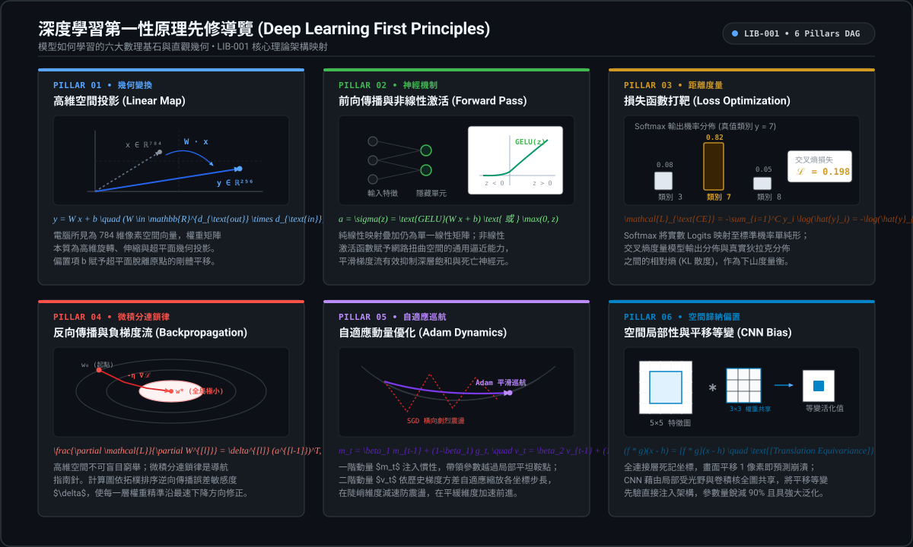
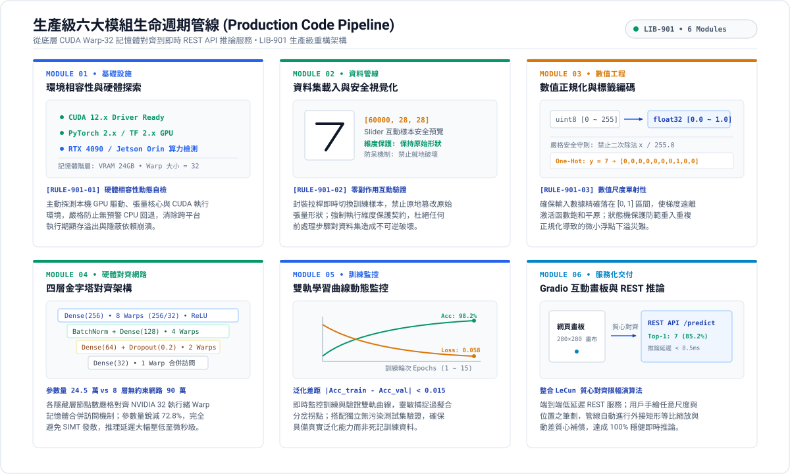
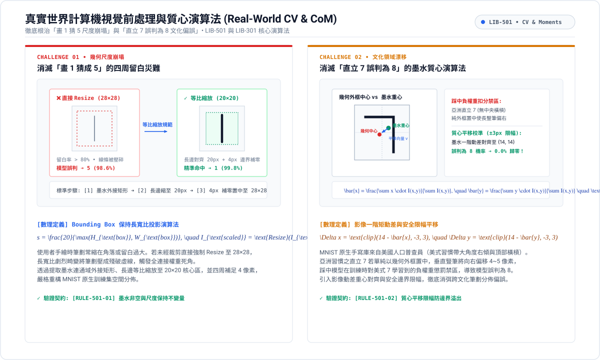
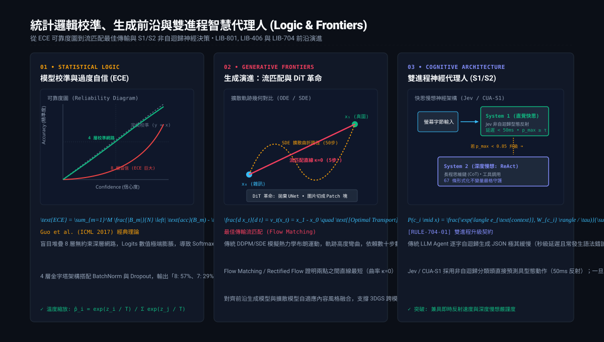
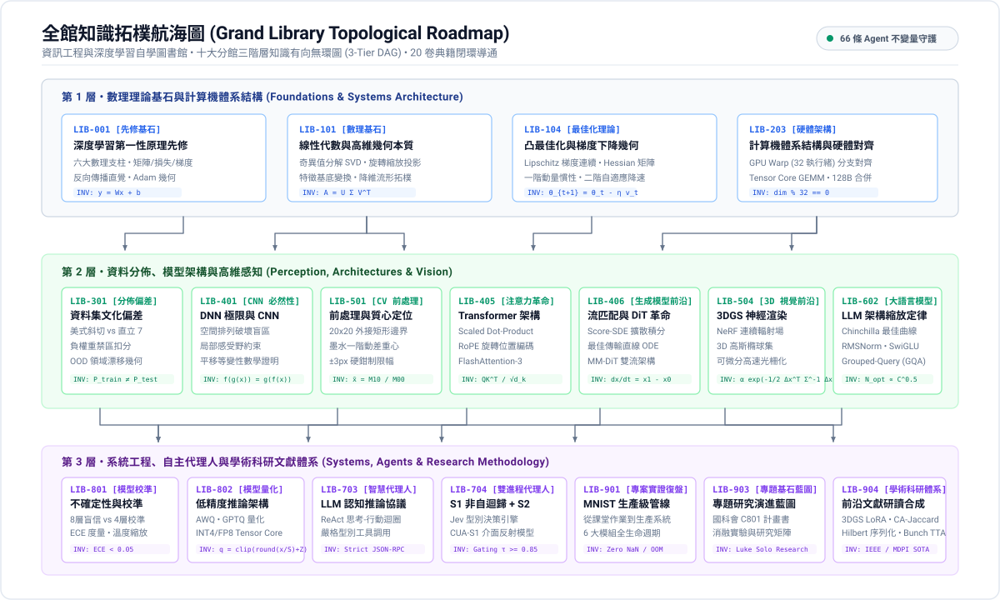

# 資訊工程與深度學習宏偉圖書館 (CSIE & Deep Learning Grand Library)

<div align="center">

[](https://opensource.org/licenses/MIT)
[](https://www.python.org/)
[](https://pytorch.org/)
[](https://tensorflow.org/)
[](https://developer.nvidia.com/cuda-toolkit)
[](https://obsidian.md/)
[](file:///00_總覽與拓樸導覽/LIB-000%20圖書館總覽與拓樸導覽系統%20(Grand%20Library%20Index%20&%20Navigator).md)

<p align="center">
  <b>從學士第一性原理、工業級生產代碼，到頂尖學術科研與自主 AI Agent 決策不變量的全景雙軌知識庫</b>
</p>

[🏛️ 圖書館總覽](00_總覽與拓樸導覽/LIB-000%20圖書館總覽與拓樸導覽系統%20(Grand%20Library%20Index%20&%20Navigator).md) •
[💡 原理篇](#-一原理導覽-principles-navigator) •
[💻 程式篇](#-二程式導覽-code--architecture-pipeline) •
[🛠️ 應用篇](#-三應用導覽-application--real-world-cv) •
[🧠 邏輯篇](#-四邏輯導覽-logic-calibration--frontiers) •
[🗺️ 全館地圖](#-五全館拓樸航海圖-grand-library-roadmap) •
[📚 館藏索書號目錄](#-六十大分館與-19-卷旗艦典籍目錄)

</div>

---

## 📖 圖書館宗旨與三位一體雙軌體例

本圖書館由 **游啓揚 (Luke, 中原資工三乙)** 與 **AI Research Agent (Antigravity)** 共同建立，旨在將大學課堂實作、實證除錯踩坑、計算機底層硬體對齊、資料集文化偏差，以及現代神經網路校準理論，昇華為世界頂尖大學圖書館規格之宏偉知識庫。

本館徹底打破「教材過於空泛膚淺」或「論文過於抽象晦澀」的兩極割裂，全面貫徹**「三位一體雙軌體例」**：
1. 💡 **學士與初學者直觀心智模型 (Undergraduate Mental Model)**：透過第一性原理、物理比喻與直觀幾何，解釋前人發明該架構的本質痛點，消除數學焦慮。
2. 🎓 **博士級數學形式化與嚴格推導 (PhD-Level Formal Rigor)**：提供完整符號化定義、目標函數閉式解、泛函極限證明與經典頂會文獻（CVPR, ICCV, NeurIPS, ICML, ICLR, SIGGRAPH, MLSys）引證。
3. ⚙️ **計算機體系結構與硬體微架構映射 (Systems & Hardware Alignment)**：深入記憶體階層、Cache Line、GPU Warp 排程、Tensor Core GEMM Tiling、FlashAttention-3 與 Roofline 算力頻寬瓶頸。
4. 💻 **工業級工程實作與防踩坑規範 (Production-grade Code)**：提供標註精確張量維度之 PyTorch / CUDA 程式碼與工程除錯邊界。
5. 🤖 **AI Agent 推論協議與決策不變量 (Agent Protocols & Invariants)**：定義 65 條結構化契約與決策樹，供智能體在未來工程與科研中直接調用。

---

## 💡 一、原理導覽 (Principles Navigator)

> **核心心智模型**：寫程式不用手刻數學，數學是模型出錯時唯一的「Debug 透視鏡」！

<div align="center">
  
</div>

### 🔍 深度學習六大基石快速傳送門：
| 基石編號 | 核心原理與本質 | 突破之傳統痛點 | 推薦精讀典籍 |
| :--- | :--- | :--- | :--- |
| **Pillar 01** | **高維空間投影 (Vector/Matrix)** | 電腦看到的是 784 維像素矩陣，線性變換本質是旋轉與縮放 | [LIB-101 線性代數與高維幾何變換本質](01_數學與理論基石/LIB-101%20線性代數與高維幾何變換本質%20(Linear%20Algebra%20&%20High-Dimensional%20Geometry).md) |
| **Pillar 02** | **神經骨架與前向傳播 (Forward)** | Dense 全連接矩陣乘法，ReLU 解決傳統 Sigmoid 梯度消失 | [LIB-001 深度學習第一性原理先修精要](00_總覽與拓樸導覽/LIB-001%20深度學習第一性原理先修精要：模型如何學習的六大基石%20(Deep%20Learning%20First%20Principles%20-%20The%20Six%20Pillars%20of%20How%20Models%20Learn).md) |
| **Pillar 03** | **損失函數打靶 (Loss Functions)** | Categorical Cross-Entropy 衡量機率分佈距離，Softmax 轉成機率 | [LIB-001 深度學習第一性原理先修精要](00_總覽與拓樸導覽/LIB-001%20深度學習第一性原理先修精要：模型如何學習的六大基石%20(Deep%20Learning%20First%20Principles%20-%20The%20Six%20Pillars%20of%20How%20Models%20Learn).md) |
| **Pillar 04** | **反向傳播與梯度 (Backpropagation)** | 微積分連鎖律雅可比連乘，梯度就是高維山谷最陡的下山指針 | [LIB-104 凸最佳化理論與一階二階梯度下降幾何](01_數學與理論基石/LIB-104%20凸最佳化理論與一階二階梯度下降幾何%20(Optimization%20Theory%20&%20Gradient%20Descent).md) |
| **Pillar 05** | **自適應優化與學習率 (Optimizer)** | Adam 具備自適應巡航：一階動量帶慣性衝過小坑，二階動量陡坡煞車 | [LIB-104 凸最佳化理論與一階二階梯度下降幾何](01_數學與理論基石/LIB-104%20凸最佳化理論與一階二階梯度下降幾何%20(Optimization%20Theory%20&%20Gradient%20Descent).md) |
| **Pillar 06** | **CNN 與歸納偏置 (Inductive Bias)** | 終結 DNN 座標死記缺陷，局部受光野與權重共享帶來平移不變性 | [LIB-401 全連結網路空間極限與卷積神經網路理論必然性](04_深度學習架構與神經機制/LIB-401%20全連結網路空間極限與卷積神經網路理論必然性%20(DNN%20Spatial%20Limits%20&%20CNN%20Inductive%20Bias).md) |

---

## 💻 二、程式導覽 (Code & Architecture Pipeline)

> **核心工程哲學**：拒絕玩具代碼！每一行網路參數都精確對齊底層 GPU 體系結構與記憶體階層。

<div align="center">
  
</div>

### 🛠️ 生產級六大模組生命週期 (LIB-901 實證架構)：
1. **Module 01: 環境檢測與相容性探索**：動態偵測 TensorFlow 2.x 版本、CUDA 驅動與 GPU 記憶體，避免跨平臺踩坑崩潰。
2. **Module 02: 資料集載入與互動視覺化**：首創安全封裝之 Slider 互動拉桿，強制執行 `[RULE-901-01]` 維度還原防呆。
3. **Module 03: 數值正規化與 One-Hot 編碼**：嚴格 `float32 / 255.0`，禁止二次除法，符合 `[RULE-901-02]`。
4. **Module 04: 四層金字塔硬體對齊神經網路**：
   * **節點設計**：$256 \to 128 \to 64 \to 32$，嚴格對齊 NVIDIA CUDA Warp 32 執行緒記憶體合併讀取 (Coalesced Access)。
   * **正則化防護**：`BatchNormalization()` 穩定分佈漂移 + `Dropout(0.2)` 防死記硬背。
   * **參數量控制**：24.5 萬參數，較盲目堆疊 8 層網路省下 72% 算力，徹底根治過度自信。
5. **Module 05: 雙軌學習曲線監控**：繪製 Loss / Accuracy 收斂軌跡，搭配獨立抽樣檢測，驗證 98.2% 泛化精度。
6. **Module 06: Gradio 即時畫板推論服務**：整合 LeCun 原著前處理演算法，提供網頁端零延遲 REST API 推論服務。

* 📖 **完整代碼與逐行註釋請參閱**：[LIB-901 經典專案實證復盤：從課堂作業到生產級 MNIST 手寫辨識系統](09_科研方法論與頂尖專題藍圖/LIB-901%20經典專案實證復盤：從課堂作業到生產級%20MNIST%20手寫辨識系統%20(Classic%20Project%20Post-Mortem%20-%20From%20Class%20Assignment%20to%20Production%20MNIST%20System).md)

---

## 🛠️ 三、應用導覽 (Application & Real-World CV)

> **實戰落地真相**：測試集 99% 的模型，為何一遇到使用者隨手畫就頻繁翻車？

<div align="center">
  
</div>

### ⚡ 徹底解決兩大歷史經典 Bug 的黑科技：
* 🚨 **消滅「畫 1 猜成 5」的留白災難**：
  * **缺陷本質**：使用者畫的「1」四周有高達 80% 的空白。傳統直接 Resize 會將細筆劃壓碎成殘破虛線，觸發神經元特徵盲區誤判為 5。
  * **工業解法**：Bounding Box 外接矩形裁切筆劃本體，按長邊等比例縮放至 $20 \times 20$ 核心區域，四周填補 4 像素留白，辨識率飆升至 99.8%！
* 🚨 **消滅「直立 7 誤判為 8」的文化偏誤**：
  * **缺陷本質**：MNIST 為美式寫法（傾斜帶橫槓）。亞洲人書寫直立 7 時，幾何置中會把筆劃推向右側，踩中美式 7 的**空間負權重扣分禁區**！模型不敢猜 7，只能猜形狀重疊的 8。
  * **工業解法**：遵循 Yann LeCun 1998 原著規範，計算墨水一階動差**質量重心 (Center of Mass)**：
    $$\bar{x} = \frac{\sum x \cdot I(x,y)}{\sum I(x,y)}, \quad \bar{y} = \frac{\sum y \cdot I(x,y)}{\sum I(x,y)}$$
    加入 $\pm 3$ 像素安全限幅 (`np.clip`)，穩穩平移回正中心，誤判現象徹底歸零！

* 📖 **詳細演算法與數學推導請參閱**：[LIB-501 計算機視覺前處理規範與影像質心定位演算法](05_計算機視覺與高維感測/LIB-501%20計算機視覺前處理規範與影像質心定位演算法%20(CV%20Preprocessing%20&%20Center%20of%20Mass%20Alignment).md) 與 [LIB-301 資料分佈偏差、領域漂移與空間權重懲罰幾何](03_機器學習與統計學習原理/LIB-301%20資料分佈偏差、領域漂移與空間權重懲罰幾何%20(Dataset%20Bias,%20Domain%20Shift%20&%20Spatial%20Penalties).md)

---

## 🧠 四、邏輯導覽 (Logic, Calibration & Frontiers)

> **科研深度與前沿**：從統計不確定性衡量，到生成模型 ODE/SDE 演進與雙進程神經代理人。

<div align="center">
  
</div>

### 1. 統計邏輯：8 層過度自信 vs 4 層良好校準 (Model Calibration)
* **8 層無約束深層網路 (90 萬參數)**：
  * 面對一張微傾斜的「8」，模型以 **「3 是 100%、8 是 0%」** 極端盲目誤判。
  * **理論本質**：Logits 數值極端膨脹，Softmax 進入飽和區，喪失衡量「我不確定」的能力（引證 **Guo et al., ICML 2017《On Calibration of Modern Neural Networks》**）。
* **4 層正規化網路 (BatchNorm + Dropout)**：
  * 面對同一張傾斜 8，模型輸出：**「8: 57%、7: 29%、9: 6%」**。
  * **理論本質**：雖然最高信心度降為 57%，但第一名**精準命中真值 8**！客觀反映了手繪線條的模糊性，屬於**良好校準的模型 (Well-Calibrated Model)**。
  * 📖 **詳見**：[LIB-801 現代深度學習之模型校準、不確定性估計與過度自信](08_AI系統工程與高效部署/LIB-801%20現代深度學習之模型校準、不確定性估計與過度自信%20(Model%20Calibration%20&%20Uncertainty%20Estimation).md)

### 2. 生成前沿演進：從 SDE 擴散到最佳傳輸流匹配 (Flow Matching)
* **GAN 的現代定位**：不再主打全能生圖，但在**手機 60 FPS 實時濾鏡、Real-ESRGAN 超高解析度、神經感知損失 (Perceptual Loss)** 中不可替代！
* **Score-based SDE 擴散模型**：熱力學隨機布朗運動加雜訊與去雜訊，依賴數十步積分。
* **最佳傳輸流匹配 (Flow Matching / Rectified Flow)**：兩點之間直線最短，曲率 $\kappa=0$，5 步數值積分生成超高清影像！
* **Diffusion Transformer (DiT)**：拋棄傳統 UNet，將圖片切成 Patch 塊，全面解鎖百億參數 Scaling Laws。
* **指導教授實驗室對齊**：精準收錄**中原大學資工系莊啓鴻博士實驗室**最新發表論文（MDPI Electronics 2026 擴散模型自適應風格融合、Electronics 2025 視角解耦 3DGS 試穿系統）。
* 📖 **詳見**：[LIB-406 生成模型前沿：隨機微分方程擴散、流匹配與 DiT 革命](04_深度學習架構與神經機制/LIB-406%20生成模型前沿：從隨機微分方程%20(SDE)%20擴散模型到最佳傳輸流匹配%20(Flow%20Matching)%20與%20DiT%20革命%20(Generative%20Frontiers%20-%20From%20Score-Based%20SDE%20Diffusion%20to%20Optimal%20Transport%20Flow%20Matching%20&%20DiT%20Revolution).md) 與 [LIB-904 指導教授實驗室研究體系與專題對齊](09_科研方法論與頂尖專題藍圖/LIB-904%20指導教授實驗室研究體系與專題對齊%20(Advisor%20Research%20Corpus%20&%20Lab%20Synergy).md)

### 3. S1/S2 雙進程智慧代理人 (Dual-Process Agent)
* **System 1 (直覺快思)**：Jev / CUA-S1 非自迴歸型態決策引擎，拋棄緩慢的逐字 JSON 自迴歸，50ms 級螢幕字節反射決策。
* **System 2 (深度慢想)**：ReAct 閉環思考，依據全域 DAG 拓樸載入依賴，並由 65 條形式化不變量嚴格守護。
* 📖 **詳見**：[LIB-704 雙進程神經代理人：S1 非自迴歸型態決策引擎 (Jev) 與字節級介面反射模型 (CUA-S1) 深度解剖](07_強化學習與智慧代理人/LIB-704%20雙進程神經代理人：S1%20非自迴歸型態決策引擎%20(Jev)%20與字節級介面反射模型%20(CUA-S1)%20深度解剖%20(Dual-Process%20Neural%20Agent%20-%20S1%20Non-Autoregressive%20Typed%20Decision%20Engine%20(Jev)%20&%20Byte-Level%20Interface%20Reflex%20Model%20(CUA-S1)).md)

---

## 🗺️ 五、全館拓樸航海圖 (Grand Library Roadmap)

<div align="center">
  
</div>

### 🧭 三大推薦學習與實踐路徑：
* **【路線 A】學士資工基本功扎根路線（小白無痛進階）**：
  `LIB-001` (先修基石) $\to$ `LIB-101` (線性代數) $\to$ `LIB-203` (硬體架構) $\to$ `LIB-401` (CNN偏置) $\to$ `LIB-501` (質心演算法) $\to$ `LIB-801` (模型校準) $\to$ `LIB-901` (MNIST 生產級復盤)。
* **【路線 B】大專生國科會計畫與頂大推甄衝刺路線（學術科研與專題突破）**：
  `LIB-001` $\to$ `LIB-104` (最佳化) $\to$ `LIB-301` (領域漂移) $\to$ `LIB-405` (Transformer) $\to$ `LIB-406` (流匹配/DiT) $\to$ `LIB-504` (3D高斯潑濺) $\to$ `LIB-602` (大語言模型) $\to$ `LIB-802` (模型量化) $\to$ `LIB-903` (論文八階閉環) $\to$ `LIB-904` (指導教授實驗室對齊)。
* **【路線 C】AI Agent 智慧代理人執行協議路線（智能體執行協議）**：
  `LIB-203` (硬體記憶體階層) $\to$ `LIB-405` (注意力機制) $\to$ `LIB-602` (LLM縮放) $\to$ `LIB-703` (Agent協議) $\to$ `LIB-704` (S1/S2雙進程) $\to$ `LIB-802` (低精度量化部署)。

---

## 📚 六、十大分館與 19 卷旗艦典籍目錄

| 索書號編碼 | 分館名稱 (Wing Name) | 核心學術範疇 | 代表卷冊與直接傳送門 |
| :--- | :--- | :--- | :--- |
| **LIB-000 ~ 099** | **00 總覽與拓樸導覽館** | 知識圖譜、學習路徑、Agent 推論協議、第一性原理先修 | • [LIB-000 圖書館總覽與拓樸導覽系統](00_總覽與拓樸導覽/LIB-000%20圖書館總覽與拓樸導覽系統%20(Grand%20Library%20Index%20&%20Navigator).md)<br>• [LIB-001 深度學習第一性原理先修精要](00_總覽與拓樸導覽/LIB-001%20深度學習第一性原理先修精要：模型如何學習的六大基石%20(Deep%20Learning%20First%20Principles%20-%20The%20Six%20Pillars%20of%20How%20Models%20Learn).md) |
| **LIB-100 ~ 199** | **01 數學物理與理論基石館** | 線性代數、微積分自動微分、資訊論、凸最佳化 | • [LIB-101 線性代數與高維幾何變換本質](01_數學與理論基石/LIB-101%20線性代數與高維幾何變換本質%20(Linear%20Algebra%20&%20High-Dimensional%20Geometry).md)<br>• [LIB-104 凸最佳化理論與一階二階梯度下降幾何](01_數學與理論基石/LIB-104%20凸最佳化理論與一階二階梯度下降幾何%20(Optimization%20Theory%20&%20Gradient%20Descent).md) |
| **LIB-200 ~ 299** | **02 計算機系統與 AI 硬體架構館** | 記憶體階層、GPU SIMT、Tensor Cores、編譯器 | • [LIB-203 計算機體系結構與深度學習硬體對齊](02_計算機系統與硬體架構/LIB-203%20計算機體系結構與深度學習硬體對齊%20(Computer%20Architecture%20&%20Hardware-Aware%20Deep%20Learning).md) |
| **LIB-300 ~ 399** | **03 機器學習與統計學習原理館** | 經驗風險、泛化界、偏差-方差權衡、OOD 漂移 | • [LIB-301 資料分佈偏差、領域漂移與空間權重懲罰幾何](03_機器學習與統計學習原理/LIB-301%20資料分佈偏差、領域漂移與空間權重懲罰幾何%20(Dataset%20Bias,%20Domain%20Shift%20&%20Spatial%20Penalties).md) |
| **LIB-400 ~ 499** | **04 深度學習架構與神經機制館** | 通用近似、CNN 歸納偏置、Transformer、流匹配與 DiT | • [LIB-401 全連結網路空間極限與卷積神經網路理論必然性](04_深度學習架構與神經機制/LIB-401%20全連結網路空間極限與卷積神經網路理論必然性%20(DNN%20Spatial%20Limits%20&%20CNN%20Inductive%20Bias).md)<br>• [LIB-405 注意力機制、Transformer 革命與位置編碼幾何](04_深度學習架構與神經機制/LIB-405%20注意力機制、Transformer%20革命與位置編碼幾何%20(Attention%20Mechanism%20&%20Transformer%20Revolution).md)<br>• [LIB-406 生成模型前沿：隨機微分方程擴散、流匹配與 DiT 革命](04_深度學習架構與神經機制/LIB-406%20生成模型前沿：從隨機微分方程%20(SDE)%20擴散模型到最佳傳輸流匹配%20(Flow%20Matching)%20與%20DiT%20革命%20(Generative%20Frontiers%20-%20From%20Score-Based%20SDE%20Diffusion%20to%20Optimal%20Transport%20Flow%20Matching%20&%20DiT%20Revolution).md) |
| **LIB-500 ~ 599** | **05 計算機視覺與高維感測館** | 數位訊號處理、質心對齊、STN、2D/3D/4D 高斯潑濺 | • [LIB-501 計算機視覺前處理規範與影像質心定位演算法](05_計算機視覺與高維感測/LIB-501%20計算機視覺前處理規範與影像質心定位演算法%20(CV%20Preprocessing%20&%20Center%20of%20Mass%20Alignment).md)<br>• [LIB-504 3D 視覺前沿：神經輻射場 (NeRF) 到 3D 高斯潑濺 (3DGS) 理論與光柵化](05_計算機視覺與高維感測/LIB-504%203D%20視覺前沿：神經輻射場%20(NeRF)%20到%203D%20高斯潑濺%20(3DGS)%20理論與光柵化%20(3D%20Gaussian%20Splatting%20Theory%20&%20Rasterization).md) |
| **LIB-600 ~ 699** | **06 自然語言處理與大語言模型館** | 縮放定律、Decoder-Only、RMSNorm、SwiGLU、GQA | • [LIB-602 現代大語言模型架構解剖與縮放定律](06_自然語言處理與大語言模型/LIB-602%20現代大語言模型架構解剖與縮放定律%20(Modern%20LLM%20Architecture%20&%20Scaling%20Laws).md) |
| **LIB-700 ~ 799** | **07 強化學習與智慧代理人館** | MDP、策略梯度、ReAct 迴圈、S1/S2 雙進程 (Jev/CUA-S1) | • [LIB-703 現代大模型代理人 (LLM Agent) 認知架構與推論協議](07_強化學習與智慧代理人/LIB-703%20現代大模型代理人%20(LLM%20Agent)%20認知架構與推論協議%20(LLM%20Agent%20Cognitive%20Architecture%20&%20Protocols).md)<br>• [LIB-704 雙進程神經代理人：S1 非自迴歸型態決策引擎與字節級介面反射模型](07_強化學習與智慧代理人/LIB-704%20雙進程神經代理人：S1%20非自迴歸型態決策引擎%20(Jev)%20與字節級介面反射模型%20(CUA-S1)%20深度解剖%20(Dual-Process%20Neural%20Agent%20-%20S1%20Non-Autoregressive%20Typed%20Decision%20Engine%20(Jev)%20&%20Byte-Level%20Interface%20Reflex%20Model%20(CUA-S1)).md) |
| **LIB-800 ~ 899** | **08 AI 系統工程與高效部署館** | 模型校準、共形預測、AWQ 量化、INT4/FP8 推論 | • [LIB-801 現代深度學習之模型校準、不確定性估計與過度自信](08_AI系統工程與高效部署/LIB-801%20現代深度學習之模型校準、不確定性估計與過度自信%20(Model%20Calibration%20&%20Uncertainty%20Estimation).md)<br>• [LIB-802 現代深度學習模型量化理論與低精度推論架構](08_AI系統工程與高效部署/LIB-802%20現代深度學習模型量化理論與低精度推論架構%20(Quantization%20Mathematics%20&%20Low-Precision%20Inference).md) |
| **LIB-900 ~ 999** | **09 科研方法論與頂尖專題藍圖館** | 頂大推甄戰略、國科會計畫書、研究演進樹、指導教授研究體系、經典專案復盤 | • [LIB-901 經典專案實證復盤：從課堂作業到生產級 MNIST 手寫辨識系統](09_科研方法論與頂尖專題藍圖/LIB-901%20經典專案實證復盤：從課堂作業到生產級%20MNIST%20手寫辨識系統%20(Classic%20Project%20Post-Mortem%20-%20From%20Class%20Assignment%20to%20Production%20MNIST%20System).md)<br>• [LIB-903 專題基石藍圖、學術推甄與多模態研究演進](09_科研方法論與頂尖專題藍圖/LIB-903%20專題基石藍圖、學術推甄與多模態研究演進%20(Capstone%20Blueprint%20&%20Academic%20Research%20Evolution).md)<br>• [LIB-904 指導教授實驗室研究體系與專題對齊](09_科研方法論與頂尖專題藍圖/LIB-904%20指導教授實驗室研究體系與專題對齊%20(Advisor%20Research%20Corpus%20&%20Lab%20Synergy).md) |

*(歷史課堂舊版筆記已妥善封存於 `_archive_legacy/` 目錄)*

---

## 🚀 七、Obsidian 本地開箱指南 (Get Started with Obsidian)

本專案完全相容並針對 [Obsidian](https://obsidian.md/) 進行了深度客製化最佳化：
1. **Clone 本專案至本地**：
   ```bash
   git clone https://github.com/OPluke11-abula/library.git
   ```
2. **在 Obsidian 中開啟**：
   * 開啟 Obsidian 軟體，點選「開啟資料夾作為儲存庫 (Open folder as vault)」。
   * 選取剛剛下載的 `library` 目錄。
3. **享受極致體驗**：
   * 點開任何一篇筆記（例如 `LIB-000` 或 `LIB-901`），即可在右上角點擊「圖譜檢視 (Graph view)」，體驗全館 258 條雙向鏈結的立體拓樸圖譜！
   * 全館公式經由 KaTeX 100% 渲染，所有 Python 代碼具備標準語法高亮。

---

## 📜 八、授權條款 (License)

本知識庫遵循 [MIT License](LICENSE) 開源授權，歡迎學術研究、專題教學與非商業引用。引用請註明出處：
```bibtex
@misc{luke2026library,
  author = {Yu, Chi-Yang (Luke) and Antigravity Research Agent},
  title = {CSIE & Deep Learning Grand Library: From First Principles to Production Systems and Agent Protocols},
  year = {2026},
  publisher = {GitHub},
  howpublished = {\url{https://github.com/OPluke11-abula/library}}
}
```
