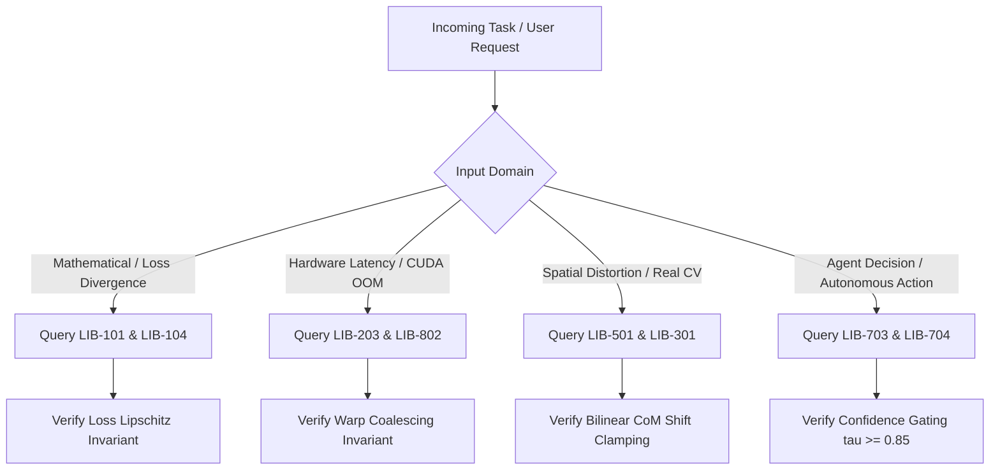

> Language / 語言: [🇹🇼 繁體中文](../../00_%E7%B8%BD%E8%A6%BD%E8%88%87%E6%8B%93%E6%A8%B8%E5%B0%8E%E8%A6%BD/LIB-000%20%E5%9C%96%E6%9B%B8%E9%A4%A8%E7%B8%BD%E8%A6%BD%E8%88%87%E6%8B%93%E6%A8%B8%E5%B0%8E%E8%A6%BD%E7%B3%BB%E7%B5%B1%20%28Grand%20Library%20Index%20&%20Navigator%29.md) | 🇺🇸 **English**

# Computer Science & Deep Learning Notes: Master Topological Navigator

## 1. Mathematical Formalization of the Knowledge DAG

The knowledge base is formalized as a finite, directed, acyclic graph:
$$\mathcal{G} = (\mathcal{V}, \mathcal{E}, \mathcal{A})$$
where:
- $\mathcal{V} = \{v_1, v_2, \dots, v_{19}\}$ is the set of 19 flagship academic volumes.
- $\mathcal{E} \subset \mathcal{V} \times \mathcal{V}$ is the set of directed dependency edges representing prerequisite orderings. If $(u, v) \in \mathcal{E}$, volume $u$ MUST be ingested and verified prior to volume $v$.
- $\mathcal{A}: \mathcal{V} \to 2^{\mathcal{I}}$ maps each node to a set of formal invariant rules $\mathcal{I} = \{\text{INV-01}, \dots, \text{INV-66}\}$.

### Topological Sort & Execution Order
Because $\mathcal{G}$ contains no directed cycles ($\nexists \text{ path } u \rightsquigarrow u$), there exists at least one linear topological ordering $\tau: \mathcal{V} \to \{1, \dots, |\mathcal{V}|\}$ satisfying:
$$(u, v) \in \mathcal{E} \implies \tau(u) < \tau(v)$$

The canonical 3-tier linear ingestion schedule for autonomous agents is:
1. **Tier 1: Core Mathematical & Hardware Primitives**:
   $$\text{LIB-001} \to \text{LIB-101} \to \text{LIB-104} \to \text{LIB-203}$$
2. **Tier 2: Perception, Spatial Biases & Neural Architectures**:
   $$\text{LIB-301} \to \text{LIB-401} \to \text{LIB-501} \to \text{LIB-405} \to \text{LIB-602} \to \text{LIB-406} \to \text{LIB-504}$$
3. **Tier 3: Systems Engineering, Agents & Empirical Research**:
   $$\text{LIB-801} \to \text{LIB-802} \to \text{LIB-703} \to \text{LIB-704} \to \text{LIB-901} \to \text{LIB-903} \to \text{LIB-904}$$

---

## 2. Classification Taxonomy & Wing Mappings

The library indexes volumes into 10 specialized functional wings based on the ACM Computing Classification System (CCS 2012) and Dewey Decimal principles:

| Call Number Range | Wing Name | Focus Domain | Key Mathematical & System Invariants |
| :--- | :--- | :--- | :--- |
| **LIB-000 ~ 099** | **00 Overview & Protocols** | DAG Navigator & First Principles | 6-Pillar framework, agent decision trees |
| **LIB-100 ~ 199** | **01 Mathematical Foundations** | Linear Algebra, SVD & Optimization | Spectral decomposition, Lipschitz gradients |
| **LIB-200 ~ 299** | **02 Computer Systems & Hardware** | Memory Hierarchy & Microarchitecture | Warp coalescing, Tensor Core GEMM tiling |
| **LIB-300 ~ 399** | **03 Machine Learning Principles** | Covariate Shift & Spatial Penalties | Out-of-Distribution bounds, cultural shift |
| **LIB-400 ~ 499** | **04 Deep Learning Architectures** | CNNs, Transformers, Flow Matching | Equivariance, RoPE, OT velocity fields |
| **LIB-500 ~ 599** | **05 Computer Vision & Sensing** | Centering Moments & 3D Splatting | Bilinear CoM shift, explicit 3D Gaussians |
| **LIB-600 ~ 699** | **06 NLP & Large Language Models** | Scaling Laws & Architecture Scaling | Chinchilla compute-optimal frontier, GQA |
| **LIB-700 ~ 799** | **07 RL & Intelligent Agents** | Dual-Process Cognition & Protocols | S1 non-autoregressive Jev, S2 ReAct gating |
| **LIB-800 ~ 899** | **08 Systems & Deployment** | Model Calibration & Quantization | ECE temperature scaling, AWQ/INT4 GEMM |
| **LIB-900 ~ 999** | **09 Research Methodology** | Capstone Post-Mortem & Literature Synthesis | C801 proposal structure, solo engineering |

---

## 3. Agent Protocol & Decision Invariants

### Mandatory Invariants for Programmatic Agents
- `INV-000-01 (Strict DAG Ordering)`: Autonomous subagents MUST NOT propose architecture modifications without validating upstream prerequisites.
- `INV-000-02 (Deterministic Reproducibility)`: Random seeds, PyTorch deterministic flags (`torch.use_deterministic_algorithms(True)`), and CUDA precision modes MUST be explicitly declared.
- `INV-000-03 (Dual-Track Verification)`: Every conceptual assertion MUST be accompanied by an executable PyTorch code verification test or explicit mathematical proof.
- `INV-000-04 (Hardware Boundedness)`: Models designed for edge deployment (Jetson Orin) MUST NOT exceed FP16 SRAM tiling limits.
