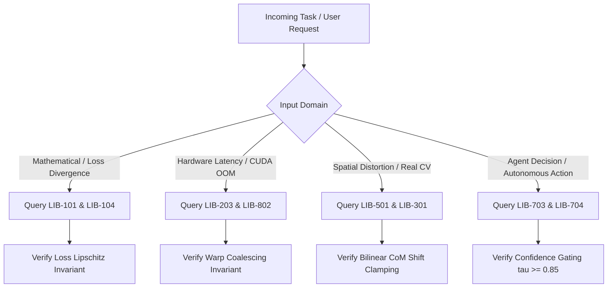

> Language / 語言: [🇹🇼 繁體中文](../../00_%E7%B8%BD%E8%A6%BD%E8%88%87%E6%8B%93%E6%A8%B8%E5%B0%8E%E8%A6%BD/LIB-000%20%E5%9C%96%E6%9B%B8%E9%A4%A8%E7%B8%BD%E8%A6%BD%E8%88%87%E6%8B%93%E6%A8%B8%E5%B0%8E%E8%A6%BD%E7%B3%BB%E7%B5%B1%20%28Grand%20Library%20Index%20&%20Navigator%29.md) | 🇺🇸 **English**

# Computer Science & Deep Learning Notes: Master Topological Navigator

## 1. Mathematical Formalization of the Knowledge DAG

The knowledge base is formalized as a finite, directed, acyclic graph:
$$\mathcal{G} = (\mathcal{V}, \mathcal{E}, \mathcal{A})$$
where:
- $\mathcal{V} = \{v_1, v_2, \dots, v_{24}\}$ is the set of 24 canonical academic volumes.
- $\mathcal{E} \subset \mathcal{V} \times \mathcal{V}$ is the set of directed dependency edges representing prerequisite orderings. If $(u, v) \in \mathcal{E}$, volume $u$ MUST be ingested and verified prior to volume $v$.
- $\mathcal{A}: \mathcal{V} \to 2^{\mathcal{I}}$ maps each node to a set of formal invariant rules $\mathcal{I} = \{\text{RULE-000-01}, \dots, \text{RULE-905-05}\}$ ($|\mathcal{I}| = 84$).

### Topological Sort & Execution Order
Because $\mathcal{G}$ contains no directed cycles ($\nexists \text{ path } u \rightsquigarrow u$), there exists at least one linear topological ordering $\tau: \mathcal{V} \to \{1, \dots, |\mathcal{V}|\}$ satisfying:
$$(u, v) \in \mathcal{E} \implies \tau(u) < \tau(v)$$

The canonical 3-tier linear ingestion schedule for autonomous agents is:
1. **Tier 1: Core Mathematical & Hardware Primitives**:
   $$\text{LIB-000} \to \text{LIB-001} \to \text{LIB-101} \to \text{LIB-104} \to \text{LIB-203}$$
2. **Tier 2: Perception, Spatial Biases, Architectures & Systems**:
   $$\text{LIB-301} \to \text{LIB-401} \to \text{LIB-801} \to \text{LIB-405} \to \text{LIB-501} \to \text{LIB-406} \to \text{LIB-602} \to \text{LIB-504} \to \text{LIB-407} \to \text{LIB-703} \to \text{LIB-802} \to \text{LIB-505} \to \text{LIB-408} \to \text{LIB-704} \to \text{LIB-506}$$
3. **Tier 3: Empirical Systems & Capstone Research**:
   $$\text{LIB-901} \to \text{LIB-903} \to \text{LIB-904} \to \text{LIB-905}$$

---

## 2. Defensible Status Taxonomy

To guarantee academic reliability and prevent decorative claims of verification, the library adheres to a strict 5-stage status taxonomy:
1. `draft`: Preliminary note or literature compilation under active synthesis; not yet peer-reviewed internally.
2. `reviewed`: Conceptually organized, internally reviewed for pedagogical and logical flow, with dependency topology verified.
3. `source-verified`: Mathematical derivations, definitions, and empirical figures have been audited directly against peer-reviewed primary literature (CVPR, ICCV, NeurIPS, ICML, ICLR, MLSys, TPAMI) or official specifications; no local empirical benchmark reproduction claimed.
4. `experiment-verified`: Code implementations, algorithmic pipelines, or numerical thresholds have been validated locally via reproducible automated test suites.
5. `production-validated`: System architecture deployed in live production with continuous telemetry and observed empirical stability.

---

## 3. Evidence Provenance Conventions

Every numerical metric, performance threshold, and scientific assertion in this library must carry explicit provenance classification:
- `[FACT]`: Established mathematical theorem, definition, or physical law.
- `[DERIVATION]`: Formal closed-form algebraic derivation from established axioms.
- `[LITERATURE_RESULT]`: Benchmark or empirical metric directly cited from peer-reviewed literature with explicit venue, authors, and conditions.
- `[EMPIRICAL_RESULT]`: Value directly measured locally via executable code in this repository.
- `[HEURISTIC]`: Practical rule of thumb or engineering guideline; not an analytic mathematical law.
- `[DESIGN_DECISION]`: Deliberate engineering choice selected among trade-offs.
- `[TARGET]`: Desired engineering or research performance goal to be validated in future experiments.
- `[SAFETY_BOUND]`: Defensive programming clamp or runtime guardrail.
- `[HYPOTHESIS]`: Theoretical conjecture or research proposition awaiting ablation testing.
- `[OPEN_QUESTION]`: Unresolved problem in literature or production systems.

---

## 4. Classification Taxonomy & Wing Mappings

The library indexes volumes into 10 specialized functional wings based on the ACM Computing Classification System (CCS 2012) and Dewey Decimal principles:

| Call Number Range | Wing Name | Focus Domain | Key Mathematical & System Invariants |
| :--- | :--- | :--- | :--- |
| **LIB-000 ~ 099** | **00 Overview & Protocols** | DAG Navigator & First Principles | 6-Pillar framework, agent decision trees |
| **LIB-100 ~ 199** | **01 Mathematical Foundations** | Linear Algebra, SVD & Optimization | Spectral decomposition, Lipschitz gradients |
| **LIB-200 ~ 299** | **02 Computer Systems & Hardware** | Memory Hierarchy & Microarchitecture | Warp coalescing, Tensor Core GEMM tiling |
| **LIB-300 ~ 399** | **03 Machine Learning Principles** | Covariate Shift & Spatial Penalties | Out-of-Distribution bounds, covariate shift |
| **LIB-400 ~ 499** | **04 Deep Learning Architectures** | CNNs, Transformers, Flow Matching, Instruction Editing & Harmonization | Equivariance, RoPE, OT velocity fields, attention locking |
| **LIB-500 ~ 599** | **05 Computer Vision & Sensing** | Centering Moments, 3DGS Splatting, Semantic Retrieval & Spatial QA | Bilinear CoM shift, explicit Gaussians, multi-view consensus |
| **LIB-600 ~ 699** | **06 NLP & Large Language Models** | Scaling Laws & Architecture Scaling | Chinchilla compute-optimal frontier, GQA |
| **LIB-700 ~ 799** | **07 RL & Intelligent Agents** | Dual-Process Cognition & Protocols | S1 non-autoregressive Jev, S2 ReAct gating |
| **LIB-800 ~ 899** | **08 Systems & Deployment** | Model Calibration & Quantization | ECE temperature scaling, AWQ/INT4 GEMM |
| **LIB-900 ~ 999** | **09 Research Methodology** | Capstone Post-Mortem, Literature Synthesis & Five Frontier Blueprints | C801 proposal structure, solo engineering, ablation matrix |

---

## 5. Agent Protocol & Decision Invariants

### [RULE-000-01] Strict DAG Dependency Ordering Invariant
- **Contract Level**: `CRITICAL_INVARIANT`
- **Specification**: Autonomous agents and researchers MUST NOT adopt, modify, or extend a library node without resolving and verifying its upstream DAG prerequisites.
- **Enforcement**: Automated topological sort verification via `scripts/validate_library.py`.

### [RULE-000-02] Deterministic Execution & Reproducibility Invariant
- **Contract Level**: `CRITICAL_INVARIANT`
- **Specification**: All code artifacts and benchmarks MUST declare exact execution seeds, framework versions, deterministic algorithm flags (`torch.use_deterministic_algorithms(True)`), and hardware specifications.

### [RULE-000-03] Dual-Track Mathematical & Code Verification Invariant
- **Contract Level**: `CRITICAL_INVARIANT`
- **Specification**: Conceptual assertions MUST be accompanied by formal mathematical derivations (with tensor dimension annotations) and runnable defensive unit tests.

### [RULE-000-04] Hardware Boundedness & Memory Budget Invariant
- **Contract Level**: `HIGH_INVARIANT`
- **Specification**: Algorithmic architectures designed for local or edge deployment MUST specify and adhere to explicit hardware resource ceilings (VRAM, SRAM tiling, compute budget).

